```{r}
knitr::opts_chunk$set(echo = FALSE)
options(knitr.kable.NA = '')
set.seed(1)
library(ggplot2)
library(kableExtra)
```

## Today {.unlisted}

[Chapter 2](https://cjvanlissa.github.io/stats12/chapter2_descriptive_statistics.html) and [Chapter 4](https://cjvanlissa.github.io/stats12/probability.html) from the gitbook.


::: callout-important
# Mistake in slide from last week!

- Deadline assignment #1 is Sunday October 18th.
- Deadline on Canvas is always guiding!
:::
# Descriptives Statistics

## Why do We use Descriptives Statistics?
- to describe the sample
- to check for mistakes (attention check)
- to check assumptions
- to answer research questions that do not require hypothesis tests

## When do We use Descriptives Statistics?

::: {.r-stack style="height: 100vh;"}

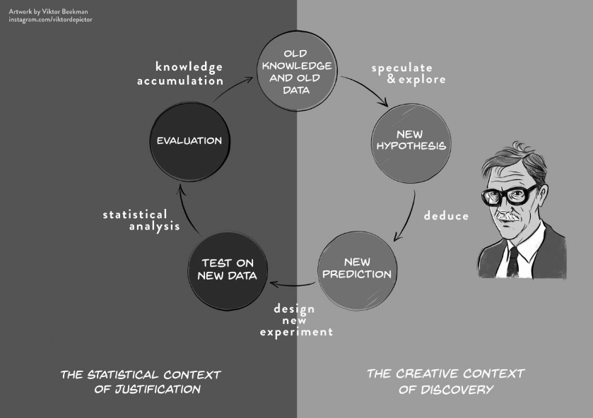{.fragment fig-align="center"  style="width: auto; height: auto; object-fit: contain;"}

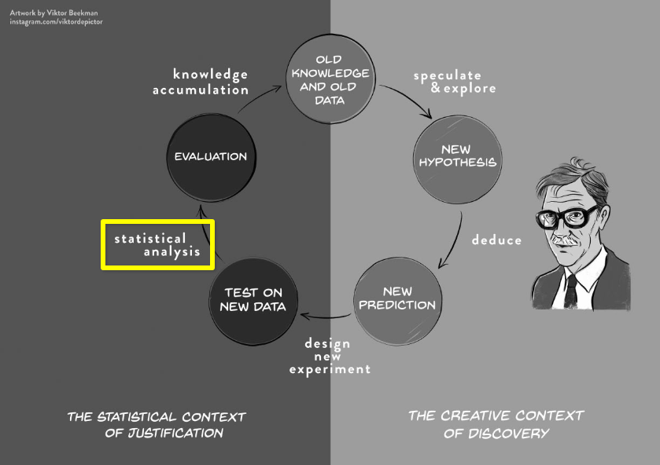{.fragment fig-align="center"  style="width: auto; height: auto; object-fit: contain;"}

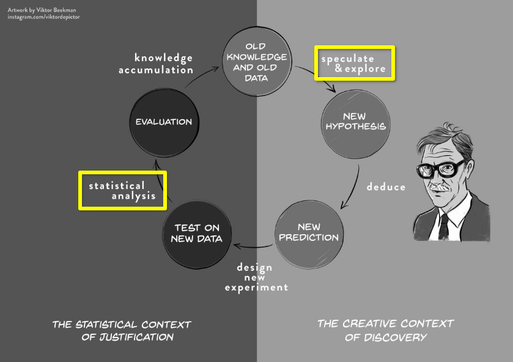{.fragment fig-align="center" style="width: auto; height: auto; object-fit: contain;"}

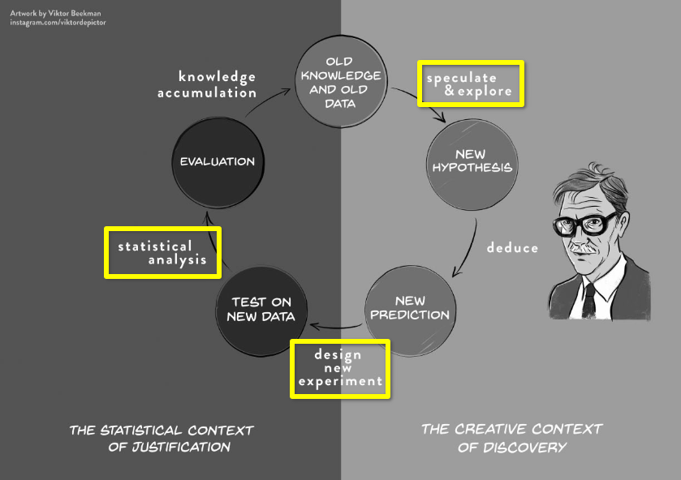{.fragment fig-align="center" style="width: auto; height: auto; object-fit: contain;"}
:::


::: footer

Source:
Wagenmakers, E. J., Dutilh, G., & Sarafoglou, A. (2018). The creativity-verification cycle in psychological science: New methods to combat old idols. \emph{Perspectives on Psychological Science}, 13(4), 418-427. <https://doi.org/10.1177/1745691618771357>

:::

## Descriptives Statistics Today

- Central Tendency
- Dispersion/ Spread/ Variability
- Skewness
- Kurtosis

. . .

## Data Example: Bechdel Test

. . .

[{fig-align="center"}](https://en.wikipedia.org/wiki/File:Dykes_to_Watch_Out_For_(Bechdel_test_origin).jpg)


## Data Example: Bechdel Test

```{r}
#| echo: false
#| label: "Bechdel dataset"
library(DT)

d <- read.csv("scripts/movies.csv")
mydata <- head(d, 30)
# minor fixes to presentation
mydata$title[1] <- "21 & Over"
DT::datatable(
  mydata,
  options = list(
  searching = FALSE,
  info = FALSE,
  paging = FALSE,
  scrollX = TRUE,
  scrollY = "350px",
  scrollCollapse = TRUE,
  autoWidth = TRUE
),
  rownames = FALSE
)

```

::: footer
[Source](https://github.com/fivethirtyeight/data/blob/4c1ff5e3aef1816ae04af63218015066e186c147/bechdel/movies.csv)
:::

## Measures of Central Tendency

The most "common" value, one "representative" number

- average student
- most popular show on Netflix
- proportion of movies that passes the bechdel test
- average movie budget
- most common bechdel test result

## Central Tendency: Mean

$$
\bar{x} = \frac{\sum_{i=1}^{n}x_i}{n} = \frac{x_1 + x_2 +\, ... + x_n}{n}
$$

Definitions:

- $x$: the variable we're interested in.
- $\bar{x}$: the sample mean of the variable
- $x_i$: the $i$th observation of the variable.
- $n$ the sample size.
- $\sum_{i=1}^{n}$: the sum from $i$ is 1 to $i$ is $n$.

## Central Tendency: Mean

- Example with four distributions
    - Normal
    - Triangle
    - Bimodal
    - Skewed

## Central Tendency: Median

::: {.callout-tip}
## Definition: Median
If you were to order all scores of your variable from lowest to highest, then the median value is the value that splits your sample in half: half of the participants score lower than this value, and half score higher.
:::

- Another name for the median is the 50th percentile. The nth percentile is the score that divides the sample so that % of participants score lower.

- If the distribution is symmetric, then the median equals the mean

## Central Tendency: Median

- Example with numbers

## Central Tendency: Median

- Example with four distributions once more


## Central Tendency: Mode


## Central Tendency: Mode

- Example with numbers

## Dispersion


# Break {.section-slide .unlisted}

See you in ~10 minutes!

# Probability

## Population versus Sample

- The "Descriptive Statistics" before were doing inference on a sample.
- We will now see that each of these has a population counterpart.

## Defining probability

**Probability:** How likely something is to occur.

* Specifically, the proportion of times we expect to observe an outcome in a *random experiment* that could be repeated many times

*Random experiment*

-   Could theoretically be repeated an infinite number of times
-   Before I flip a coin, the coinflip is a random experiment with $P_{heads} = .5$, or 50%
-   After I flip the coin, it's no longer random; it's fixed (either 100% or 0%)

## Examples probability

Probability:

-   of a baby being born male, $p_{male} = .51$
-   of rolling a 7 with two dice in Catan, $p_7 = .167$

Not probability:

-   The probability that there is life on other planets is either 100% or 0%
-   Even if you don't know which is correct

## Random variables

**Random variable**: An unknown value that follows some probability distribution.

*Disambiguation: Last lecture we used "variable" as a placeholder for some unknown number.*

-   The outcome of a coin toss is a random variable
-   It is discrete because it has only two possible outcomes
-   The probability distributions is
    -   P(X = heads) = 0.5
    -   P(X = tails) = 0.5
    -   Together: 1.0, so all possible outcomes are covered

# Discrete probability distributions

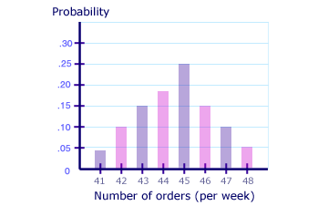{width=80%}

## Frequency vs probability

Frequency distributions

-   Summarize observed outcomes in a sample
-   E.g., the number of Dutch/foreign students in this class

A probability distribution is similar, but

-   Can be interpreted as the (estimated) probability of observing these outcomes in the future
-   E.g., if I select a random student in this class, what's the probability that they will be Dutch?

<!-- ## Random sample -->

## Discrete distributions

-   Probability mass function
    - 100% of the probability mass is distributed among finite discrete outcomes
-   Finite number of outcomes
    - Dutch student / foreign student
    - Student has tattoos / no tattoos
    - Describe using contingency table or bar chart

<!-- -   Each has a probability -->
<!--     -   $p_{tattoo} = .36$, $p_{\text{no tattoo}} = .64$ -->
<!--     -   $p_{Dutch} = .70$, $p_{\text{foreign}} = .30$ -->
<!-- -   Describe using table or bar chart -->

<!-- ```{r} -->
<!-- tab = data.frame(Value = c("Tattoo", "No tattoo"), Probability = c(.36, .64)) -->
<!-- knitr::kable(tab, digits = 2) -->
<!-- ``` -->

<!-- ## Cross table -->

```{r}
library(gtsummary)
set.seed(1)
n = 74
dutch <- sample.int(2, size = n, replace = TRUE, prob = c(.3, .7))
tattoo <- sapply(c(.2, .5)[dutch], rbinom, n = 1, size = 1)
df_tattoo <- data.frame(Dutch = ordered(dutch, levels = c(1,2), labels = c("No", "Yes")),
                 Tattoo = ordered(tattoo, levels = c(0,1), labels = c("No", "Yes")))
tmp <- table(df_tattoo); cell11 = tmp[1,1]; cell12 = tmp[1,2]; cell21 = tmp[2,1]; cell22 = tmp[2,2]
library(gt)
tbl_cross(df_tattoo, row=Dutch, col=Tattoo, percent="none")
```

## Indexing contingency tables

$i$: row

$j$: column

$f$: frequency (number of observations)

$f_{i,j}$: frequency in the cell in row $i$, column $j$


```{r}
df <- data.frame("$i$" = c("$i = 1$", "$i = 2$", "<b>Margin columns</b>"),
                 "$j = 1$" = c("$f_{1,1}$", "$f_{2,1}$", "$f_{+,1}$"),
                 "$j = 2$" = c("$f_{1,2}$", "$f_{2,2}$",  "$f_{+,2}$"),
                 "<b>Margin rows</b>" = c("$f_{1,+}$", "$f_{2,+}$", "$f_{+,+}$"),
                 check.names = FALSE)

kbl(df, escape = FALSE, align = rep('l', length(df[,1])), format = "markdown") %>%
  kable_styling("striped") %>%
  add_header_above(c(" " = 1, "$j$" = 2, " " = 1))
```

## Marginal frequency distribution

Separate frequency distribution of each variable in contingency table

```{r}
kable(df, escape = FALSE, align = rep('l', length(df[,1])), format = "markdown") |>
  kable_styling("striped") |>
  add_header_above(c(" " = 1, "$j$" = 2, " " = 1))
```


## Marginal frequency distribution

<font color = "orange">For the variable "Tattoo":</font> How many people do / don't have one?

<font color = "purple">For the variable "Dutch":</font> How many students are Dutch / International?

```{r}
df <- data.frame("Dutch" = c("No", "Yes", "<b>Total column</b>"),
                 "No" = c(cell11, cell21, cell11+cell21),
                 "Yes" = c(cell12, cell22, cell12+cell22),
                 "Total row" = c(
                   cell11+cell12, cell21+cell22, cell11+cell12+cell21+cell22),
                 check.names = FALSE)
df$`Total row`[1:2] <- cell_spec(df$`Total row`[1:2], color = "purple", bold = TRUE)
df$No[3] <- cell_spec(df$No[3], color = "orange", bold = TRUE)
df$Yes[3] <- cell_spec(df$Yes[3], color = "orange", bold = TRUE)
kable(df, escape = FALSE, align = rep('l', length(df[,1]))) %>%
  kable_styling("striped") %>%
  add_header_above(c(" " = 1, "Tattoo" = 2, " " = 1))
```

## Conditional frequency distribution

Frequency distribution of one variable, for specific value of the other variable

E.g.: What is the conditional frequency distribution of Tattoos <font color = "purple">**for Dutch students?**</font>

```{r}
df <- data.frame("Dutch" = c("No", "Yes", "<b>Total column</b>"),
                 "No" = c(cell11, cell21, cell11+cell21),
                 "Yes" = c(cell12, cell22, cell12+cell22),
                 "Total row" = c(cell11+cell12,cell21+cell22,cell11+cell12+cell21+cell22),
                 check.names = FALSE)
df$No[2] <- cell_spec(df$No[2], color = "purple", bold = TRUE)
df$Yes[2] <- cell_spec(df$Yes[2], color = "purple", bold = TRUE)
kable(df, escape = FALSE, align = rep('l', length(df[,1]))) %>%
  kable_styling("striped") %>%
  add_header_above(c(" " = 1, "Tattoo" = 2, " " = 1))
```

## Joint frequency distribution

Frequency of a combination of two (or more) variables

E.g.: What is the frequency of <font color = "purple">**Dutch students with a tattoo**</font>?

```{r}
df <- data.frame("Dutch" = c("No", "Yes", "<b>Total column</b>"),
                 "No" = c(cell11, cell21, cell11+cell21),
                 "Yes" = c(cell12, cell22, cell12+cell22),
                 "Total row" = c(cell11+cell12,cell21+cell22,cell11+cell12+cell21+cell22),
                 check.names = FALSE)
df$Yes[2] <- cell_spec(df$Yes[2], color = "purple", bold = TRUE)
kbl(df, escape = FALSE, align = rep('l', length(df[,1]))) %>%
  kable_styling("striped") |>
  add_header_above(c(" " = 1, "Tattoo" = 2, " " = 1))
```


## Frequencies to probabilities

Divide frequencies by a total to get a probability distribution

Which frequencies and which total you use depends on what probability distribution you want

## Marginal probability distribution

Divide marginal totals by the <font color = "orange">global total</font>

E.g.: What is the <font color = "purple">marginal probability distribution of being Dutch</font>? $P(Dutch)$

```{r}
df <- data.frame("Dutch" = c("No", "Yes", "<b>Total column</b>"),
                 "No" = c(cell11, cell21, cell11+cell21),
                 "Yes" = c(cell12, cell22, cell12+cell22),
                 "Total row" = c(
                   paste0(cell11+cell12, " / ", cell11+cell12+cell21+cell22, " = ", round((cell11+cell12)/(cell11+cell12+cell21+cell22), digits = 2)),
                   paste0(cell21+cell22, " / ", cell11+cell12+cell21+cell22, " = ", round((cell21+cell22)/(cell11+cell12+cell21+cell22), digits = 2)), paste0(cell11+cell12+cell21+cell22)),
                 check.names = FALSE)
df$`Total row`[1:2] <- cell_spec(df$`Total row`[1:2], color = "purple", bold = TRUE)
df$`Total row`[3] <- cell_spec(df$`Total row`[3], color = "orange", bold = TRUE)
kable(df, escape = FALSE, align = rep('l', length(df[,1]))) %>%
  kable_styling("striped") %>%
  add_header_above(c(" " = 1, "Tattoo" = 2, " " = 1))
```

## Conditional probability distribution

Divide the row- or column frequencies by the <font color = "orange">marginal total</font>

E.g.: What is the conditional probability of <font color = "purple">having a tattoo for international students</font>?  $P(Tattoo | Dutch)$


```{r}
df <- data.frame("Dutch" = c("No", "Yes", "<b>Total column</b>"),
                 "No" = c(cell11, paste0(cell21, " / ", cell21+cell22, " = ", round((cell21)/(cell21+cell22), digits = 2)), cell11+cell21),
                 "Yes" = c(cell12, paste0(cell22, " / ", cell21+cell22, " = ", round((cell22)/(cell21+cell22), digits = 2)), cell12+cell22),
                "Total row" = c(cell11+cell12,
                                 cell21+cell22,cell11+cell12+cell21+cell22),
                 check.names = FALSE)
df$Yes[2] <- cell_spec(df$Yes[2], color = "purple", bold = TRUE)
df$No[2] <- cell_spec(df$No[2], color = "purple", bold = TRUE)
df$`Total row`[2] <- cell_spec(df$`Total row`[2], color = "orange", bold = TRUE)
kable(df, escape = FALSE, align = rep('l', length(df[,1]))) %>%
  kable_styling("striped") %>%
  add_header_above(c(" " = 1, "Tattoo" = 2, " " = 1))

```


## Joint probability distribution

Divide the cell frequency by the <font color = "orange">global total</font>

E.g.: What is the joint probability of someone being <font color = "purple">Dutch and having a tattoo</font>? $P(Dutch \cap Tattoo)$


```{r}
df <- data.frame("Dutch" = c("No", "Yes", "<b>Total column</b>"),
                 "No" = c(cell11, paste0(cell21, " / ", cell21+cell22+cell11+cell12, " = ", round((cell21)/(cell11+cell12+cell21+cell22), digits = 2)), cell11+cell21),
                 "Yes" = c(cell12, cell22, cell12+cell22),
                "Total row" = c(cell11+cell12,
                                 cell21+cell22, cell11+cell12+cell21+cell22),
                 check.names = FALSE)
df$No[2] <- cell_spec(df$No[2], color = "purple", bold = TRUE)
df$`Total row`[3] <- cell_spec(df$`Total row`[3], color = "orange", bold = TRUE)
kable(df, escape = FALSE, align = rep('l', length(df[,1]))) %>%
  kable_styling("striped") %>%
  add_header_above(c(" " = 1, "Tattoo" = 2, " " = 1))
```

# Continuous probability distributions

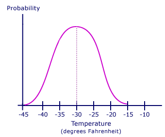{width=80%}

<!-- ::: {layout-ncol=2} -->
<!-- {width=80%} -->

<!-- {width=80%} -->
<!-- ::: -->


## Continuous probability distributions

* Infinite possible outcomes
* No exact probability for specific values
* Continuous *probability density function* describes how likely each outcome is
    + Cf. probability mass function for discrete outcomes
* Surface area determines probability
* Many probability distributions exist
* This course covers only one...

## Normal Distribution

Theoretical distribution for continuous variables

Bell-shaped, symmetric, from -infinity to +infinity

You can use it to describe (=model) real data

Two parameters:

-   Mean $\mu$ ("mu"): Most common / average value
-   Standard deviation $\sigma$ ("sigma"): Average deviation from the mean

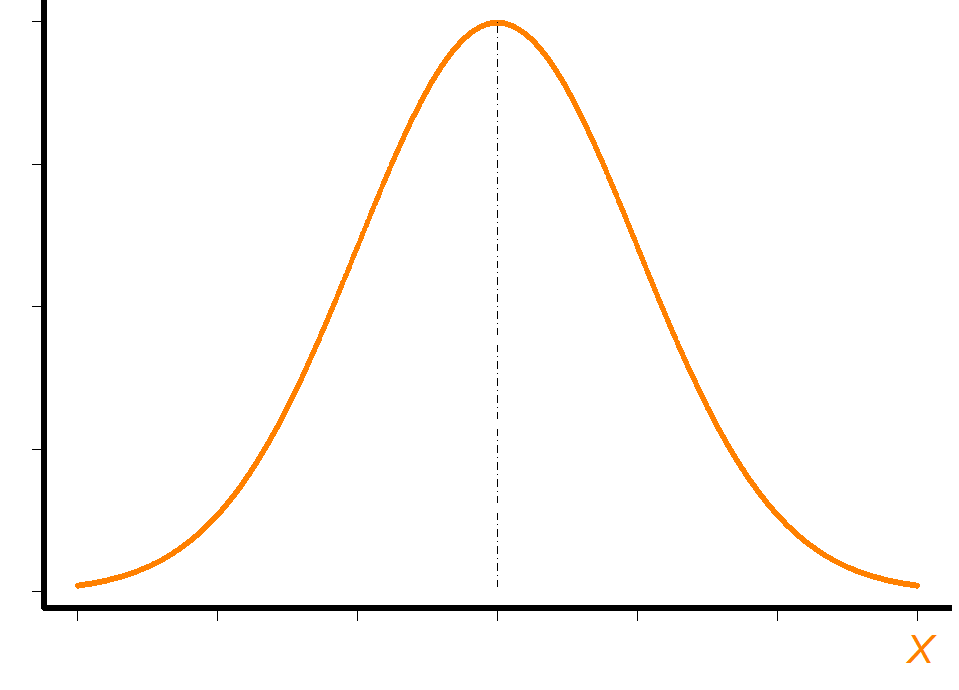{width=40%, fig-align="center"}

## Examples of Normal Distributions

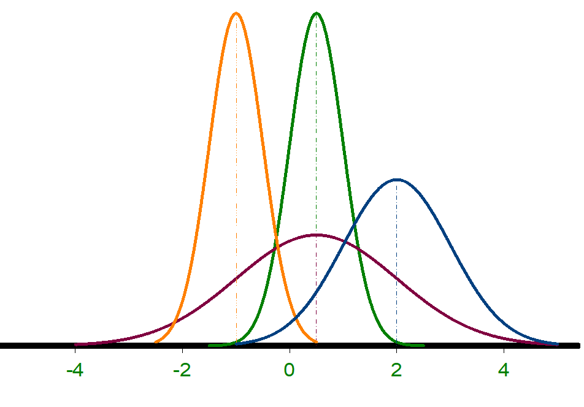

| Dist. |   $\mu$   |  $\sigma$  |
|:-----:|:-----:|:---:|
|   1   | --1.0 | 0.5 |
|   2   |  0.5  | 0.5 |
|   3   |  0.5  | 1.5 |
|   4   |  2.0  | 1.0 |

## App

<https://statdist.com/distributions/normal>

<!-- ## Normal distribution: Location and scale -->

<!-- ```{r eval = FALSE} -->
<!-- library(shiny) -->
<!-- numericInput( -->
<!--   inputId = "mean", -->
<!--   label = "Mean:", -->
<!--   value = 0, -->
<!--   min = -4, -->
<!--   max = 4, -->
<!--   step = .2 -->
<!-- ); numericInput( -->
<!--   inputId = "sd", -->
<!--   label = "Standard deviation:", -->
<!--   value = 1, -->
<!--   min = 0, -->
<!--   max = 2, -->
<!--   step = .2 -->
<!-- ) -->

<!-- plotOutput("normdist") -->
<!-- ``` -->

<!-- ```{r eval = FALSE} -->
<!-- #| context: server -->
<!-- library(2) -->

<!-- output$normdist <- renderPlot({ p1 <- (data = data.frame(x = c(-5, 5)), aes(x)) + -->
<!--   stat_function(fun = dnorm, n = 101, args = list(mean = input$mean, sd = input$sd)) + ylab("Probability density") + -->
<!--   scale_y_continuous(breaks = NULL) -->
<!-- p1 + theme_bw() -->
<!-- }) -->
<!-- ``` -->

## Standard Normal Distribution (Z-distribution)

$Z \sim N(\mu = 0, \sigma^2 = 1)$ (so also $\sigma = 1$)

* We can standardize any normal distribution to the *Z*-distribution
* This removes the units of measurement of our original variable
* Standardizing allows us to calculate probabilities more easily
* Stats books contain probability values for the Z-distribution
* We can always convert back to the original units

## Standard Normal Distribution

$Z \sim N(\mu = 0, \sigma = 1)$

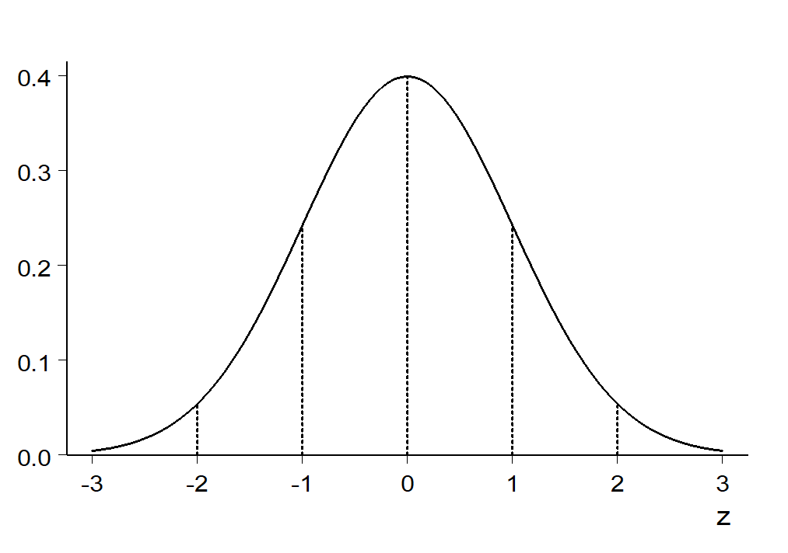

## X to Z and vice versa

You can standardize values of any normally distributed variable

$Z = \frac{X-\mu_x}{\sigma_x}$

**Standardizing:** Removing the original units of measurement

And reverse it to get the units back; for any Z-value:

$X = \mu_x + (Z*\sigma_x)$

## Properties of normal distribution

* The distribution is symmetric

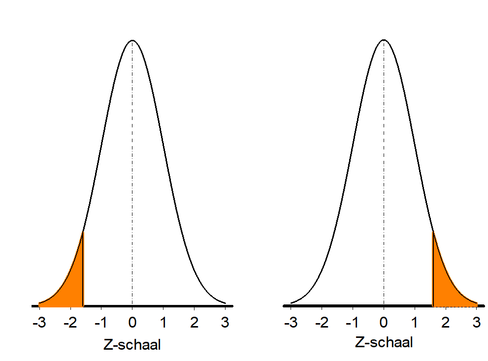

$P(Z < -1.64) = P(Z > 1.64) = 0.05$

## Properties 2

* Total surface area is 1
* We can find areas by taking the complement (1-something)

$P(Z < 1.64) = .95$

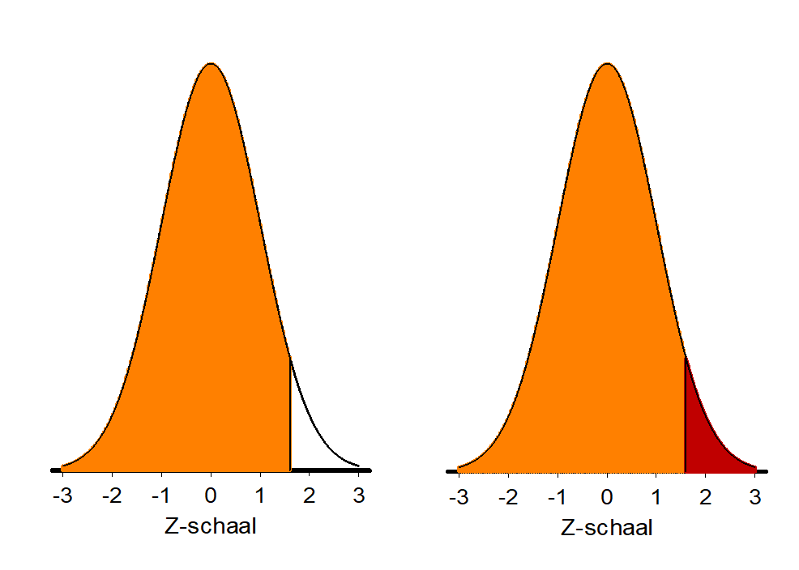{fig-align="center"}

So $P(Z > 1.64) = 1-.95 = .05$

## Properties 3

* Areas can be added

$P(Z > 0) = .5$

$P(-.5< Z < 0) = .19$

::: {layout-ncol=2}
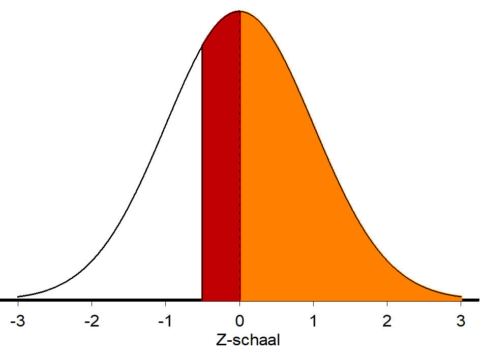{width=50%}

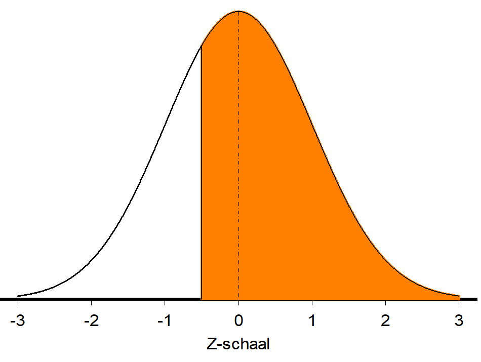{width=50%}
:::

So $P(Z > -.5) = .5+.19 = .69$

## Properties 4

Standard percentages for mean, +/- 1, 2, 3 SD

* 50% of distribution is below $\mu$, 50% above

```{r}
library(ggplot2)
ggplot(data = data.frame(x = c(-4, 4)), aes(x)) +
  stat_function(fun = dnorm, n = 101, args = list(mean = 0, sd = 1)) +
  ylab("Probability density") +
  xlab("Z") +
  scale_y_continuous(breaks = NULL, expand = c(0,0)) +
  scale_x_continuous(breaks = c(-4:4)) +
  geom_vline(xintercept = 0, color = "black") +
  geom_area(stat = "function", fun = dnorm, fill = "red", alpha = .2, xlim = c(-1, 1), args = list(mean = 0, sd = 1)) +
  geom_area(stat = "function", fun = dnorm, fill = "red", alpha = .2, xlim = c(-2, 2), args = list(mean = 0, sd = 1)) +
  geom_area(stat = "function", fun = dnorm, fill = "red", alpha = .2, xlim = c(-3, 3), args = list(mean = 0, sd = 1)) +
  geom_errorbar(aes(xmin = -1, xmax = 1, y = dnorm(1)), width = .03)+
  geom_label(x = 0, y = dnorm(1), label = "+/-1SD: 68%") +
  geom_errorbar(aes(xmin = -2, xmax = 2, y = dnorm(2)), width = .03)+
  geom_label(x = 0, y = dnorm(2), label = "+/-2SD: 95%") +
  geom_errorbar(aes(xmin = -3, xmax = 3, y = dnorm(3)), width = .03)+
  geom_label(x = 0, y = dnorm(3), label = "+/-3SD: 99.7%") +
  theme_bw()
```

## Percentiles

The $k$-th percentile is the score below which $k$ percent of scores fall

So in the standard normal distribution:

* The mean/median is the 50th percentile, because $P(Z < 0) = .5$
* We call the 25th and 75th percentile the first and third *quartile*
* +1SD is the 84th percentile, because $P(Z < 1) = .84$

## Percentiles for X-scores

Let's apply this to $IQ \sim N(\mu = 100, \sigma = 15)$

* What percentile corresponds to IQ < 120?
* $Z = \frac{120-100}{15} = 1.33$
* $P(Z<1.33) \approx .90$,  so 90th percentile

```{r out.width="70%"}
library(ggplot2)
boxloc <- -.003
x <- rnorm(10000, 100, 15)
ggplot(data = data.frame(x = x), aes(x = x)) +
    stat_function(fun = dnorm, n = 101, args = list(mean = 100, sd = 15)) +
    ylab("Probability density") +
    xlab("IQ") +
    geom_boxplot(ymin = boxloc-.002, ymax = boxloc+.002, y =boxloc)+
    scale_y_continuous(breaks = NULL, expand = c(0,0), limits = c(boxloc-.0025, .027))+
    geom_hline(yintercept = 0)+
    scale_x_continuous(breaks = c(90, 100, 110, 120)) +
    geom_vline(xintercept = 100, color = "black") +
    geom_vline(xintercept = 90, color = "red") +
    geom_vline(xintercept = 110, color = "red") +
    geom_vline(xintercept = 120, color = "green") +
    theme_bw()
```

# Describing data

## A simple model

We can use the normal distribution as a *model* for the distribution of an observed variable

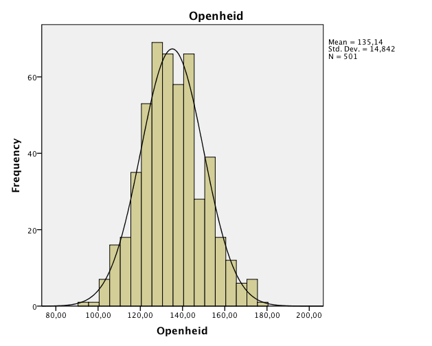{fig-align="center"}


## A simple model

"We assume variable X to be normally distributed"

This allows us to:

* Summarize people's values with just a mean and SD
* Calculate probabilities of observing certain scores using table

## Models can be wrong

Of course, the assumption can be wrong

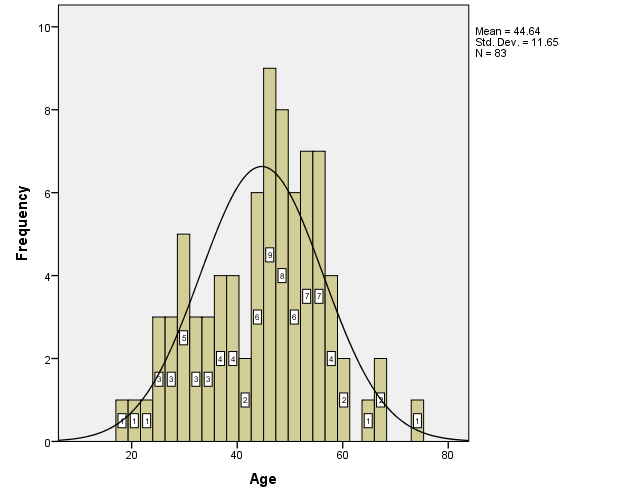{fig-align="center"}


* "All models are wrong, but some are useful" (Box)
* In this example, mean, SD, and probabilities are going to misrepresent our data somewhat (i.e.: not very useful)

## What if the model is wrong?

Solution:

* Choose a different probability distribution (not part of this course)
* Comment that the assumption of normality may be violated (e.g., in Discussion section)


<!-- ## Personality of 501 psychology students -->

<!--  -->

<!--  -->

<!--  -->

<!--  -->

# Exercises

## Exercises

Neuroticism is distributed $N(\mu = 50, \sigma = 10)$

What is the probability that a randomly chosen person has a neuroticism score of 60 or higher?

Complete the sentence: "95% of the population scores between ... and ... on neuroticism.

## Solutions

What is the probability that a randomly chosen person has a neuroticism score of 60 or higher?

```{r}
library(ggplot2)
ggplot(data = data.frame(x = c(10, 90)), aes(x)) +
    stat_function(fun = dnorm, n = 101, args = list(mean = 50, sd = 10)) +
  ylab("Probability density") +
  xlab("Neuroticism") +
    scale_y_continuous(breaks = NULL, expand = c(0,0), limits = c(0, .045)) +
    scale_x_continuous(breaks = c(25, 50, 60, 75)) +
    geom_vline(xintercept = 50, color = "black") +
    geom_vline(xintercept = 60, color = "red") +
    geom_area(stat = "function", fun = dnorm, fill = "red", alpha = .2, xlim = c(60, 90), args = list(mean = 50, sd = 10)) +
    geom_label(x = 50, y = .04, label = "Mean, 0.5") +
    geom_label(x = 60, y = .03, label = "+1SD, +0.34", hjust = 0, color = "red") +
  geom_label(x = 70, y = .005, label = "1 - (.5 + .34)", hjust = 0, color = "red") +
    theme_bw()
```

## Solutions

Complete the sentence: "95% of the population scores between ... and ... on neuroticism.

```{r}
library(ggplot2)
ggplot(data = data.frame(x = c(10, 90)), aes(x)) +
    stat_function(fun = dnorm, n = 101, args = list(mean = 50, sd = 10)) +
  ylab("Probability density") +
  xlab("Neuroticism") +
    scale_y_continuous(breaks = NULL, expand = c(0,0), limits = c(0, .045)) +
    scale_x_continuous(breaks = c(20, 30, 40, 50, 60, 70, 80)) +
    geom_vline(xintercept = 30, color = "red") +
    geom_vline(xintercept = 70, color = "red") +
    geom_area(stat = "function", fun = dnorm, fill = "red", alpha = .2, xlim = c(10, 30), args = list(mean = 50, sd = 10)) +
  geom_area(stat = "function", fun = dnorm, fill = "red", alpha = .2, xlim = c(70, 90), args = list(mean = 50, sd = 10)) +
    geom_label(x = 30, y = .005, label = "-2SD, .025", hjust = 1, color = "red") +
    geom_label(x = 70, y = .005, label = "+2SD, .025", hjust = 0, color = "red") +
     theme_bw()
```

## Calculate Z-values and p-values

1. **Draw the problem**
2. Check if the solution is (close to) a standard value like +/-SD
3. If not, calculate Z-score
4. Find p-value
    * In Z-table
    * Using an online calculator, e.g. https://onecompiler.com/r: `pnorm(zscore, mean, sd, lower.tail = TRUE)`
    * Using Excel formula: `=NORM.DIST(zscore, mean, sd, TRUE)`

## More difficult example

**Example:** Assume height is distributed

$\text{Height}\sim N(\mu = 180, \sigma = 20)$

* What percentage of the population is taller than 212cm?

Step 1: Draw the problem

Step 2: Standard solution? Not really

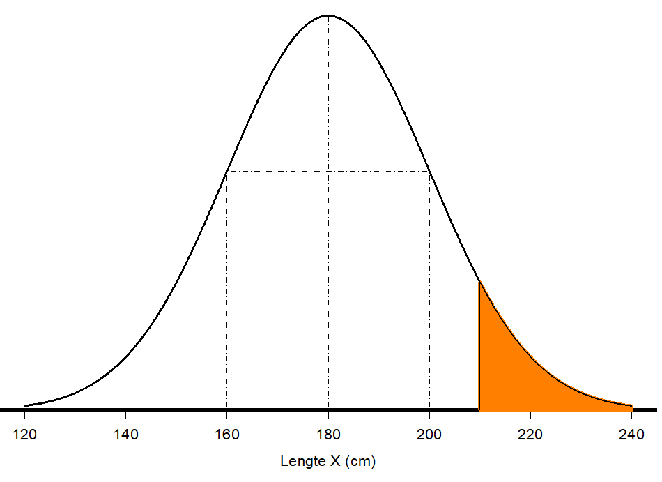{fig-align="center"}


## Calculate p-value

Step 3: Calculate Z-score

* $Z = \frac{212 - 180}{20} = 1.6$

Step 4: Find p-value

* To the **right** of 1.6
* Excel: `=1-NORM.DIST(1.6, 0, 1, TRUE)`
* R: `pnorm(1.6, 0, 1, lower.tail = FALSE)`
* Table (next slide)

## Z-table

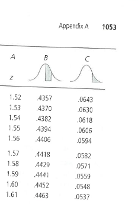{fig-align="center"}

**Conclusion:** 5.48% of the population is taller than 212cm.

