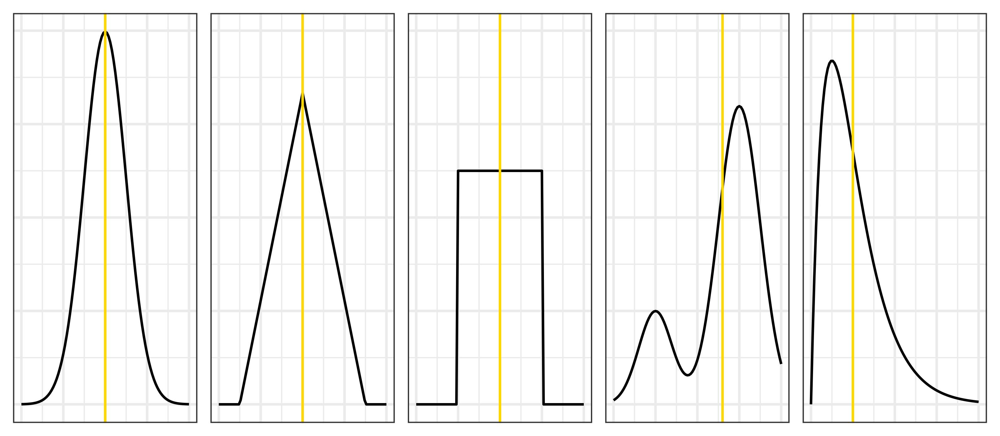
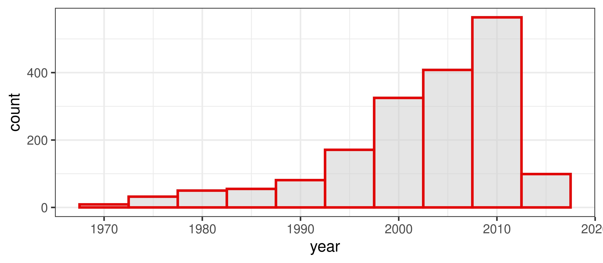
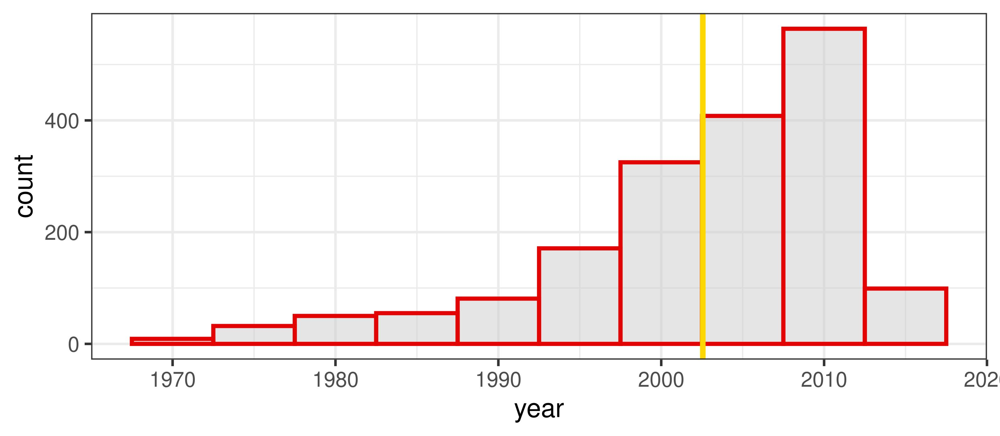
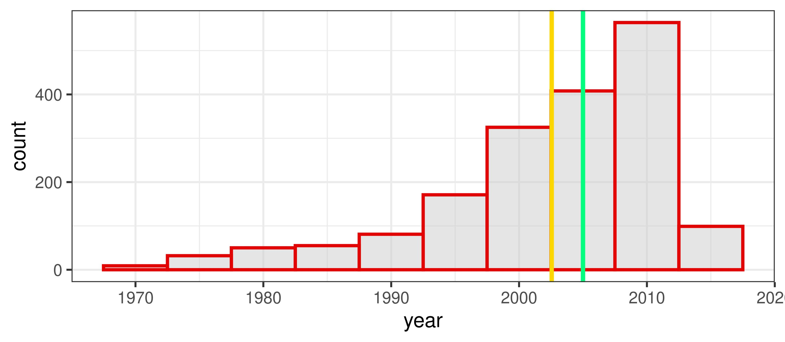
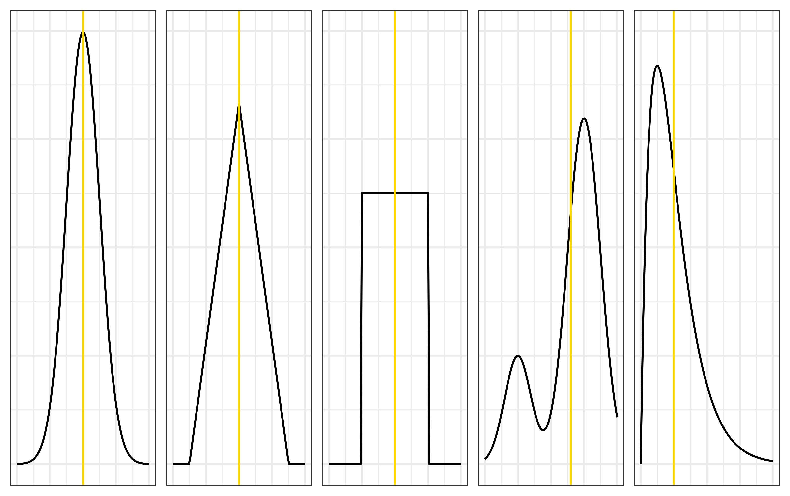
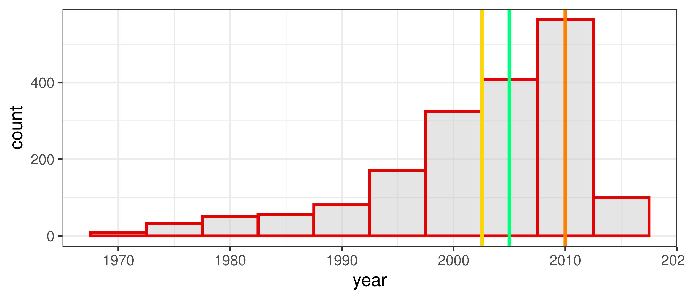
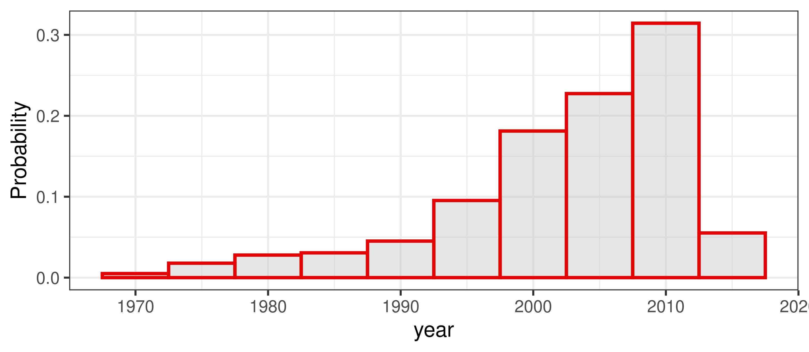
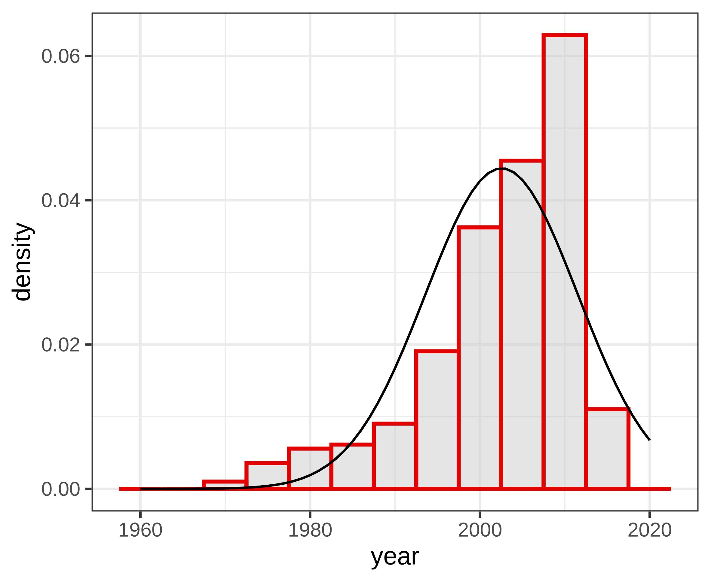

```{r}
knitr::opts_chunk$set(echo = FALSE)
options(knitr.kable.NA = '')
set.seed(1)
library(ggplot2)
library(kableExtra)

library(ggplot2)
library(tibble)

dtriangle <- function(x, a = -1, b = 1, c = 0) {
  ifelse(x < a, 0,
  ifelse(b < x, 0,
  ifelse(a <= x & x < c, 2 * (x - a) / ((b - a) * (c - a)),
  ifelse(c < x & x <= b, 2 * (b - x) / ((b - a) * (b - c)),
    # x == c
    2 / (b - a)
  ))))
}


```

## Today {.unlisted}

[Chapter 2](https://cjvanlissa.github.io/stats12/chapter2_descriptive_statistics.html) and [Chapter 4](https://cjvanlissa.github.io/stats12/probability.html) from the gitbook.


::: callout-important
# Mistake in slide from last week!

- Deadline assignment #1 is Sunday October 18th.
- Deadline on Canvas is always guiding!
:::
# Descriptives Statistics

## Why do We use Descriptives Statistics?
- to describe the sample
- to check for mistakes (attention check)
- to check assumptions
- to answer research questions that do not require hypothesis tests

## When do We use Descriptives Statistics?

::: {.r-stack style="height: 40vh;"}

{ fig-align="center"  style="width: auto; height: auto; object-fit: contain;"}

{.fragment fig-align="center"  style="width: auto; height: auto; object-fit: contain;"}

{.fragment fig-align="center" style="width: auto; height: auto; object-fit: contain;"}

{.fragment fig-align="center" style="width: auto; height: auto; object-fit: contain;"}
:::


::: footer

Source:
Wagenmakers, E. J., Dutilh, G., & Sarafoglou, A. (2018). The creativity-verification cycle in psychological science: New methods to combat old idols. \emph{Perspectives on Psychological Science}, 13(4), 418-427. <https://doi.org/10.1177/1745691618771357>

:::

## Descriptives Statistics Today

- Central Tendency
- Dispersion/ Spread/ Variability
- Skewness
- Kurtosis

## Data Example: Bechdel Test

. . .

[{fig-align="center"}](https://en.wikipedia.org/wiki/File:Dykes_to_Watch_Out_For_(Bechdel_test_origin).jpg)


## Data Example: Bechdel Test

```{r}
#| echo: false
#| label: "Bechdel dataset"
library(DT)

d <- read.csv("scripts/movies.csv")
mydata <- head(d, 30)
# minor fixes to presentation
mydata$title[1] <- "21 & Over"
DT::datatable(
  mydata,
  options = list(
  searching = FALSE,
  info = FALSE,
  paging = FALSE,
  scrollX = TRUE,
  scrollY = "350px",
  scrollCollapse = TRUE,
  autoWidth = TRUE
),
  rownames = FALSE
)

```

::: footer
[Source](https://github.com/fivethirtyeight/data/blob/4c1ff5e3aef1816ae04af63218015066e186c147/bechdel/movies.csv)
:::

## Measures of Central Tendency

The most "common" value, one "representative" number

- average student
- most popular show on Netflix
- proportion of movies that passes the bechdel test
- average movie budget
- most common bechdel test result

## Central Tendency: Mean

$$
\bar{x} = \frac{\sum_{i=1}^{n}x_i}{n} = \frac{x_1 + x_2 +\, ... + x_n}{n}
$$

Definitions:

- $x$: the variable we're interested in.
- $\bar{x}$: the sample mean of the variable
- $x_i$: the $i$th observation of the variable.
- $n$ the sample size.
- $\sum_{i=1}^{n}$: the sum from $i$ is 1 to $i$ is $n$.

## Central Tendency: Mean

Let's call "PASS" 1 and "FAIL" 0.

What does the mean of these numbers compute?

. . .

The proportion of movies that passed the Bechdel test.

. . .

No. "PASS" (`{r} sum(d$binary=="PASS", na.rm = TRUE)`) / No. Movies (`{r} nrow(d)`) =
`{r} round(mean(d$binary=="PASS", na.rm = TRUE), 3)`

## Central Tendency: Mean

{fig-align="center"}


## Central Tendency: Median

::: {.callout-tip}
## Definition: Median
If you were to order all scores of your variable from lowest to highest, then the median value is the value that splits your sample in half: half of the participants score lower than this value, and half score higher.
:::

- Another name for the median is the 50th percentile. The nth percentile is the score that divides the sample so that % of participants score lower.

- If the distribution is symmetric, then the median equals the mean

## Central Tendency: Median {.scrollable}

```{r}
#| echo: false
#| label: "Freq table"
gt::gt(as.data.frame(table(Year = d$year)))
```

## Central Tendency: Median

::: {.r-stack}

{ fig-align="center"}

{.fragment fig-align="center"}

{.fragment fig-align="center"}

:::

## Central Tendency: Median

{fig-align="center"}


## Central Tendency: Mode

- The most common value


## Central Tendency: Mode

{fig-align="center"}

## Dispersion

- Range
- Sum of Squared Distances to the Mean
- Variance: mean squared distance
- Standard Deviation
- Mean absolute deviation (MAD)

## Range

$$
R = x_{\mathrm{largest}} - x_{\mathrm{smallest}}
$$

. . .

$R_\mathrm{year}$: `{r} max(d$year)` $-$ `{r} min(d$year)` $=$ `{r} diff(range(d$year))`.

. . .

## Sum of Squared Distances to the Mean: $SS_x$ {.small-slide}

$$
\begin{align}
\bar{x} &= \frac{\sum_{i=1}^{n}x_i}{n} &&= \frac{x_1 + x_2 +\, ... + x_n}{n}\\
SS_x &= \sum_{i=1}^{n}(x_i - \bar{x})^2 &&= (x_1 -\bar{x})^2 + (x_2 -\bar{x})^2 +\, ... + (x_n -\bar{x})^2
\end{align}
$$

. . .

- $\overline{\mathrm{year}} =$ `{r} mean(d$year)`
- $SS_{\mathrm{year}} =$ `{r} format(sum((d$year - mean(d$year))^2))`

## Variance: mean squared distance {.small-slide}

$$
\begin{align}
\bar{x} &= \frac{\sum_{i=1}^{n}x_i}{n} &&= \frac{x_1 + x_2 +\, ... + x_n}{n}\\
SS_x &= \sum_{i=1}^{n}(x_i - \bar{x})^2 &&= (x_1 -\bar{x})^2 + (x_2 -\bar{x})^2 +\, ... + (x_n -\bar{x})^2\\
s^2_x &= \frac{SS_x}{n}&&
\end{align}
$$

- $\overline{\mathrm{year}} =$ `{r} mean(d$year)`
- $SS_{\mathrm{year}} =$ `{r} format(sum((d$year - mean(d$year))^2))`
- $s^2_{\mathrm{year}} =$ `{r} sum((d$year - mean(d$year))^2) / nrow(d)`


## Standard Deviation: root mean squared distance {.small-slide}

$$
\begin{align}
\bar{x} &= \frac{\sum_{i=1}^{n}x_i}{n} &&= \frac{x_1 + x_2 +\, ... + x_n}{n}\\
SS_x &= \sum_{i=1}^{n}(x_i - \bar{x})^2 &&= (x_1 -\bar{x})^2 + (x_2 -\bar{x})^2 +\, ... + (x_n -\bar{x})^2\\
s^2_x &= \frac{SS_x}{n}&&\\
s_x &= \sqrt{s^2_x}&&
\end{align}
$$


- $\overline{\mathrm{year}}$ = `{r} mean(d$year)`
- $SS_{\mathrm{year}}$ = `{r} format(sum((d$year - mean(d$year))^2))`
- $s^2_{\mathrm{year}}$ = `{r} sum((d$year - mean(d$year))^2) / nrow(d)`
- $s_{\mathrm{year}}$ = `{r} sqrt(sum((d$year - mean(d$year))^2) / nrow(d))`

## Mean absolute deviation (MAD)

$$
\mathrm{MAD}_{x} = \frac{\sum_{i=1}^{n}|x_i - \bar{x}|}{n} = \frac{|x_1 -\bar{x}| + |x_2 -\bar{x}| +\, ... + |x_n -\bar{x}|}{n}\\
$$

- $\mathrm{MAD}_{\mathrm{year}} =$ `{r} mean(abs(d$year - mean(d$year)))`

## Skewness and Kurtosis

- Skewness governs symmetry
  + positive skew / right tailed / larger observations _more_ likely than smaller observations
  + negative skew left tailed  / larger observations _less_ likely than smaller observations
  + no skew / symmetric / / larger observations _equally_ likely as smaller observations
- Kurtosis governs extreme values
  + High kurtosis: extreme values are rare relative to values near the median
  + Low kurtosis: extreme values are common relative to values near the median

## Skewness and Kurtosis



## What have we learned?

- Most movies did not pass the Bechdel test.
- Most movies are from 2000 - 2010.
- The distribution of years is _left skewed_.

# Probability

## Population versus Sample

- The "Descriptive Statistics" before were doing inference on a sample.
- We will now see that each of these has a population counterpart.
- For this, we first need to some probability theory.

## Defining probability

**Probability:** How likely something is to occur.

* Specifically, the proportion of times we expect to observe an outcome in a *random experiment* that could be repeated many times

*Random experiment*

-   Could theoretically be repeated an infinite number of times
-   Before I flip a coin, the coinflip is a random experiment with $P_{heads} = .5$, or 50%
-   After I flip the coin, it's no longer random; it's fixed (either 100% or 0%)

## Examples probability

Probability:

-   of a baby being born male, $p_{male} = .51$
-   of rolling a 7 with two dice in Catan, $p_7 = .167$

Not probability:

-   The probability that there is life on other planets is either 100% or 0%
-   Even if you don't know which is correct

## Random variables

**Random variable**: An unknown value that follows some probability distribution.

*Disambiguation: Last lecture we used "variable" as a placeholder for some unknown number.*

-   The outcome of a coin toss is a random variable
-   It is discrete because it has only two possible outcomes
-   The probability distributions is
    -   P(X = heads) = 0.5
    -   P(X = tails) = 0.5
    -   Together: 1.0, so all possible outcomes are covered

# Break {.section-slide .unlisted}

See you in ~10 minutes!

# Discrete probability distributions

{fig-align="center"}

## Frequency vs probability

Frequency distributions

-   Summarize observed outcomes in a sample
-   E.g., the number of Dutch/foreign students in this class

A probability distribution is similar, but

-   Can be interpreted as the (estimated) probability of observing these outcomes in the future
-   E.g., if I select a random student in this class, what's the probability that they will be Dutch?

<!-- ## Random sample -->

## Discrete distributions

-   Probability mass function (pmf)
    - 100% of the probability mass is distributed among finite discrete outcomes
-   Discrete => Finite number of outcomes
    - Dutch student / foreign student
    - Student has tattoos / no tattoos
    - Movie passes/ fails the Bechdel test
    - Describe using contingency table or bar chart


```{r}
library(gtsummary)
library(gt)
# set.seed(1)
# n = 74
# dutch <- sample.int(2, size = n, replace = TRUE, prob = c(.3, .7))
# tattoo <- sapply(c(.2, .5)[dutch], rbinom, n = 1, size = 1)
# df_tattoo <- data.frame(Dutch = ordered(dutch, levels = c(1,2), labels = c("No", "Yes")),
#                  Tattoo = ordered(tattoo, levels = c(0,1), labels = c("No", "Yes")))
# tmp <- table(df_tattoo); cell11 = tmp[1,1]; cell12 = tmp[1,2]; cell21 = tmp[2,1]; cell22 = tmp[2,2]
# tbl_cross(df_tattoo, row=Dutch, col=Tattoo, percent="none")

df2 <- read.csv(file = "scripts/movies2.csv")
df2$director_gender[is.na(df2$director_gender)] <- "Mixed/other"
df2$Test <- df2$binary
df2$Gender <- df2$director_gender
# df2$Gender <- ifelse(df2$Gender == "Mixed/other", "Other", df2$Gender)
tbl_cross(df2, row=Test, col=Gender, percent="none")

```

## Indexing contingency tables

$i$: row

$j$: column

$f$: frequency (number of observations)

$f_{i,j}$: frequency in the cell in row $i$, column $j$


```{r}
# df <- data.frame("$i$" = c("$i = 1$", "$i = 2$", "<b>Margin columns</b>"),
#                  "$j = 1$" = c("$f_{1,1}$", "$f_{2,1}$", "$f_{+,1}$"),
#                  "$j = 2$" = c("$f_{1,2}$", "$f_{2,2}$",  "$f_{+,2}$"),
#                  "<b>Margin rows</b>" = c("$f_{1,+}$", "$f_{2,+}$", "$f_{+,+}$"),
#                  check.names = FALSE)

df <- data.frame(
  "\\(i\\)" = c("\\(i = 1\\)", "\\(i = 2\\)", "<b>Margin columns</b>"),
  "\\(j = 1\\)" = c("\\(f_{1,1}\\)", "\\(f_{2,1}\\)", "\\(f_{+,1}\\)"),
  "\\(j = 2\\)" = c("\\(f_{1,2}\\)", "\\(f_{2,2}\\)", "\\(f_{+,2}\\)"),
  "<b>Margin rows</b>" = c("\\(f_{1,+}\\)", "\\(f_{2,+}\\)", "\\(f_{+,+}\\)"),
  check.names = FALSE
)
kbl(df, escape = FALSE, align = rep('l', length(df[,1])), format = "html") %>%
  kable_styling("striped") %>%
  add_header_above(c(" " = 1, "$j$" = 2, " " = 1), escape = FALSE)
```

## Marginal frequency distribution

Separate frequency distribution of each variable in contingency table

```{r}
kable(df, escape = FALSE, align = rep('l', length(df[,1])), format = "html") |>
  kable_styling("striped") |>
  add_header_above(c(" " = 1, "\\(j\\)" = 2, " " = 1), escape = FALSE)
```


## Marginal frequency distribution

<font color = "orange">For the variable "Gender":</font> How female directors?

<font color = "purple">For the variable "Test":</font> How many movies passed?

```{r}
tmp <- table(df2$Test, df2$Gender)
cell11 <- tmp["FAIL", "Female"]
cell12 <- tmp["FAIL", "Male"]
cell13 <- tmp["FAIL", "Mixed/other"]

cell21 <- tmp["PASS", "Female"]
cell22 <- tmp["PASS", "Male"]
cell23 <- tmp["PASS", "Mixed/other"]

df <- data.frame(
  "Test" = c("FAIL", "PASS", "<b>Total column</b>"),
  "Female" = c(cell11, cell21, cell11 + cell21),
  "Male" = c(cell12, cell22, cell12 + cell22),
  "Mixed/other" = c(cell13, cell23, cell13 + cell23),
  "Total row" = c(
    cell11 + cell12 + cell13,
    cell21 + cell22 + cell23,
    cell11 + cell12 + cell13 + cell21 + cell22 + cell23
  ),
  check.names = FALSE
)

# Highlight row margins
df$`Total row`[1:2] <- cell_spec(
  df$`Total row`[1:2],
  color = "purple",
  bold = TRUE
)

# Highlight column margins
df$Female[3] <- cell_spec(
  df$Female[3],
  color = "orange",
  bold = TRUE
)

df$Male[3] <- cell_spec(
  df$Male[3],
  color = "orange",
  bold = TRUE
)

df$`Mixed/other`[3] <- cell_spec(
  df$`Mixed/other`[3],
  color = "orange",
  bold = TRUE
)

kable(
  df,
  escape = FALSE,
  align = rep("l", ncol(df)),
  format = "html"
) %>%
  kable_styling("striped") %>%
  add_header_above(
    c(" " = 1, "Director gender" = 3, " " = 1),
    escape = FALSE
  )
```

## Conditional frequency distribution

Frequency distribution of one variable, for specific value of the other variable

E.g.: What is the conditional frequency distribution of Gender <font color = "purple">**for movies that passed?**</font>

```{r}

df <- data.frame(
  "Test" = c("FAIL", "PASS", "<b>Total column</b>"),
  "Female" = c(cell11, cell21, cell11 + cell21),
  "Male" = c(cell12, cell22, cell12 + cell22),
  "Mixed/other" = c(cell13, cell23, cell13 + cell23),
  "Total row" = c(
    cell11 + cell12 + cell13,
    cell21 + cell22 + cell23,
    cell11 + cell12 + cell13 + cell21 + cell22 + cell23
  ),
  check.names = FALSE
)

df$Female[2] <- cell_spec(
  df$Female[2],
  color = "purple",
  bold = TRUE
)

df$Male[2] <- cell_spec(
  df$Male[2],
  color = "purple",
  bold = TRUE
)

df$`Mixed/other`[2] <- cell_spec(
  df$`Mixed/other`[2],
  color = "purple",
  bold = TRUE
)

kable(
  df,
  escape = FALSE,
  align = rep("l", ncol(df)),
  format = "html"
) %>%
  kable_styling("striped") %>%
  add_header_above(
    c(" " = 1, "Director gender" = 3, " " = 1),
    escape = FALSE
  )

```

## Joint frequency distribution

Frequency of a combination of two (or more) variables

E.g.: What is the frequency of <font color = "purple">**movies that passed with a male director**</font>?

```{r}
df <- data.frame(
  "Test" = c("FAIL", "PASS", "<b>Total column</b>"),
  "Female" = c(cell11, cell21, cell11 + cell21),
  "Male" = c(cell12, cell22, cell12 + cell22),
  "Mixed/other" = c(cell13, cell23, cell13 + cell23),
  "Total row" = c(
    cell11 + cell12 + cell13,
    cell21 + cell22 + cell23,
    cell11 + cell12 + cell13 + cell21 + cell22 + cell23
  ),
  check.names = FALSE
)

df$Male[2] <- cell_spec(
  df$Male[2],
  color = "purple",
  bold = TRUE
)

kbl(
  df,
  escape = FALSE,
  align = rep("l", ncol(df)),
  format = "html"
) %>%
  kable_styling("striped") |>
  add_header_above(
    c(" " = 1, "Director gender" = 3, " " = 1),
    escape = FALSE
  )
```


## Frequencies to probabilities

Divide frequencies by a total to get a probability distribution

Which frequencies and which total you use depends on what probability distribution you want

## Marginal probability distribution

Divide marginal totals by the <font color = "orange">global total</font>

E.g.: What is the <font color = "purple">marginal probability distribution of a movie passing</font>? $P(Pass)$

```{r}
total_n <- cell11 + cell12 + cell13 +
           cell21 + cell22 + cell23

df <- data.frame(
  "Test" = c("FAIL", "PASS", "<b>Total column</b>"),
  "Female" = c(
    cell11,
    cell21,
    cell11 + cell21
  ),
  "Male" = c(
    cell12,
    cell22,
    cell12 + cell22
  ),
  "Mixed/other" = c(
    cell13,
    cell23,
    cell13 + cell23
  ),
  "Total row" = c(
    paste0(
      cell11 + cell12 + cell13,
      " / ",
      total_n,
      " = ",
      round((cell11 + cell12 + cell13) / total_n, digits = 2)
    ),
    paste0(
      cell21 + cell22 + cell23,
      " / ",
      total_n,
      " = ",
      round((cell21 + cell22 + cell23) / total_n, digits = 2)
    ),
    paste0(total_n)
  ),
  check.names = FALSE
)

df$`Total row`[1:2] <- cell_spec(
  df$`Total row`[1:2],
  color = "purple",
  bold = TRUE
)

df$`Total row`[3] <- cell_spec(
  df$`Total row`[3],
  color = "orange",
  bold = TRUE
)

kable(
  df,
  escape = FALSE,
  align = rep("l", ncol(df)),
  format = "html"
) %>%
  kable_styling("striped") %>%
  add_header_above(
    c(" " = 1, "Director gender" = 3, " " = 1),
    escape = FALSE
  )
```

## Conditional probability distribution

Divide the row- or column frequencies by the <font color = "orange">marginal total</font>

E.g.: What is the conditional probability of <font color = "purple">passing the test for a movie with a male director</font>?  $P(Pass | Male)$


```{r}

pass_total <- cell21 + cell22 + cell23
total_n <- cell11 + cell12 + cell13 +
           cell21 + cell22 + cell23

df <- data.frame(
  "Test" = c("FAIL", "PASS", "<b>Total column</b>"),
  "Female" = c(
    cell11,
    paste0(
      cell21, " / ", pass_total, " = ",
      round(cell21 / pass_total, digits = 2)
    ),
    cell11 + cell21
  ),
  "Male" = c(
    cell12,
    paste0(
      cell22, " / ", pass_total, " = ",
      round(cell22 / pass_total, digits = 2)
    ),
    cell12 + cell22
  ),
  "Mixed/other" = c(
    cell13,
    paste0(
      cell23, " / ", pass_total, " = ",
      round(cell23 / pass_total, digits = 2)
    ),
    cell13 + cell23
  ),
  "Total row" = c(
    cell11 + cell12 + cell13,
    pass_total,
    total_n
  ),
  check.names = FALSE
)

df$Female[2] <- cell_spec(
  df$Female[2],
  color = "purple",
  bold = TRUE
)

df$Male[2] <- cell_spec(
  df$Male[2],
  color = "purple",
  bold = TRUE
)

df$`Mixed/other`[2] <- cell_spec(
  df$`Mixed/other`[2],
  color = "purple",
  bold = TRUE
)

df$`Total row`[2] <- cell_spec(
  df$`Total row`[2],
  color = "orange",
  bold = TRUE
)

kable(
  df,
  escape = FALSE,
  align = rep("l", ncol(df)),
  format = "html"
) %>%
  kable_styling("striped") %>%
  add_header_above(
    c(" " = 1, "Director gender" = 3, " " = 1),
    escape = FALSE
  )

```


## Joint probability distribution

Divide the cell frequency by the <font color = "orange">global total</font>

E.g.: What is the joint probability of a movie <font color = "purple">Passing and having a female director</font>? $P(Pass \cap Female)$


```{r}

total_n <- cell11 + cell12 + cell13 +
           cell21 + cell22 + cell23

df <- data.frame(
  "Test" = c("FAIL", "PASS", "<b>Total column</b>"),
  "Female" = c(
    cell11,
    paste0(
      cell21, " / ", total_n, " = ",
      round(cell21 / total_n, digits = 2)
    ),
    cell11 + cell21
  ),
  "Male" = c(
    cell12,
    cell22,
    cell12 + cell22
  ),
  "Mixed/other" = c(
    cell13,
    cell23,
    cell13 + cell23
  ),
  "Total row" = c(
    cell11 + cell12 + cell13,
    cell21 + cell22 + cell23,
    total_n
  ),
  check.names = FALSE
)

df$Female[2] <- cell_spec(
  df$Female[2],
  color = "purple",
  bold = TRUE
)

df$`Total row`[3] <- cell_spec(
  df$`Total row`[3],
  color = "orange",
  bold = TRUE
)

kable(
  df,
  escape = FALSE,
  align = rep("l", ncol(df)),
  format = "html"
) %>%
  kable_styling("striped") %>%
  add_header_above(
    c(" " = 1, "Director gender" = 3, " " = 1),
    escape = FALSE
  )

```


# Continuous probability distributions

{width=80%}

<!-- ::: {layout-ncol=2} -->
<!-- {width=80%} -->

<!-- {width=80%} -->
<!-- ::: -->


## Continuous probability distributions

* Infinite possible outcomes
* No exact probability for specific values
* Continuous *probability density function* describes how likely each outcome is
    + Cf. probability mass function for discrete outcomes
* Surface area determines probability
* Many probability distributions exist
* This course covers only one...

## Normal Distribution

Theoretical distribution for continuous variables

Bell-shaped, symmetric, from -infinity to +infinity

You can use it to describe (=model) real data

Two parameters:

-   Mean $\mu$ ("mu"): Most common / average value
-   Standard deviation $\sigma$ ("sigma"): Average deviation from the mean

{width=40%, fig-align="center"}

## Examples of Normal Distributions


| Dist. |   $\mu$   |  $\sigma$  |
|:-----:|:-----:|:---:|
|   1   | --1.0 | 0.5 |
|   2   |  0.5  | 0.5 |
|   3   |  0.5  | 1.5 |
|   4   |  2.0  | 1.0 |

## Normal Demo




## Standard Normal Distribution (Z-distribution)

$Z \sim N(\mu = 0, \sigma^2 = 1)$
Note $\sigma^2 = \sigma = 1$

* The normal distribution is _closed_ under linear transformations.
    + i.e., if $Y~N(a, b)$ then $X = c \times Y + d \sim N(c\times a + d, c \times b)$.

Because of this:

* We can standardize any normal distribution to the *Z*-distribution
* This removes the units of measurement of our original variable
* Standardizing allows us to calculate probabilities more easily
* Stats books contain probability values for the Z-distribution
* We can always convert back to the original units

## Standard Normal Distribution

$Z \sim N(\mu = 0, \sigma = 1)$

{fig-align="center"}

## X to Z and vice versa

You can standardize values of any normally distributed variable

$$
Z = \frac{X-\mu_x}{\sigma_x}
$$

**Standardizing:** Removing the original units of measurement

And reverse it to get the units back; for any Z-value:

$$
X = \mu_x + (Z\times\sigma_x)
$$

## Properties of the Normal Distribution (1 / 4)

* The distribution is symmetric

{fig-align="center"}

$P(Z < -1.64) = P(Z > 1.64) = 0.05$

## Properties of the Normal Distribution (2 / 4)

* Total surface area is 1
* We can find areas by taking the complement (1-something)

$P(Z < 1.64) = .95$

{fig-align="center"}

So $P(Z > 1.64) = 1-.95 = .05$

## Properties of the Normal Distribution (3 / 4)

* Areas can be added

$P(Z > 0) = .5$

$P(-.5< Z < 0) = .19$

::: {layout-ncol=2}
{width=50%}

{width=50%}
:::

So $P(Z > -.5) = .5+.19 = .69$

## Properties of the Normal Distribution (4 / 4)

Standard percentages for mean, +/- 1, 2, 3 SD

* 50% of distribution is below $\mu$, 50% above

```{r}
#| fig-align: "center"
library(ggplot2)
ggplot(data = data.frame(x = c(-4, 4)), aes(x)) +
  stat_function(fun = dnorm, n = 101, args = list(mean = 0, sd = 1)) +
  ylab("Probability density") +
  xlab("Z") +
  scale_y_continuous(breaks = NULL, expand = c(0,0)) +
  scale_x_continuous(breaks = c(-4:4)) +
  geom_vline(xintercept = 0, color = "black") +
  geom_area(stat = "function", fun = dnorm, fill = "red", alpha = .2, xlim = c(-1, 1), args = list(mean = 0, sd = 1)) +
  geom_area(stat = "function", fun = dnorm, fill = "red", alpha = .2, xlim = c(-2, 2), args = list(mean = 0, sd = 1)) +
  geom_area(stat = "function", fun = dnorm, fill = "red", alpha = .2, xlim = c(-3, 3), args = list(mean = 0, sd = 1)) +
  geom_errorbar(aes(xmin = -1, xmax = 1, y = dnorm(1)), width = .03)+
  geom_label(x = 0, y = dnorm(1), label = "+/-1SD: 68%") +
  geom_errorbar(aes(xmin = -2, xmax = 2, y = dnorm(2)), width = .03)+
  geom_label(x = 0, y = dnorm(2), label = "+/-2SD: 95%") +
  geom_errorbar(aes(xmin = -3, xmax = 3, y = dnorm(3)), width = .03)+
  geom_label(x = 0, y = dnorm(3), label = "+/-3SD: 99.7%") +
  theme_bw(base_size = 20)
```

## Percentiles

The $k$-th percentile is the score below which $k$ percent of scores fall

So in the standard normal distribution:

* The mean/median is the 50th percentile, because $P(Z < 0) = .5$
* We call the 25th and 75th percentile the first and third *quartile*
* +1SD is the 84th percentile, because $P(Z < 1) = .84$

## Percentiles for X-scores

Let's apply this to $IQ \sim N(\mu = 100, \sigma = 15)$

* What percentile corresponds to IQ < 120?
* $Z = \frac{120-100}{15} = 1.33$
* $P(Z<1.33) \approx .90$,  so 90th percentile

```{r out.width="70%"}
#| fig-align: "center"
library(ggplot2)
boxloc <- -.003
x <- rnorm(10000, 100, 15)
ggplot(data = data.frame(x = x), aes(x = x)) +
    stat_function(fun = dnorm, n = 101, args = list(mean = 100, sd = 15)) +
    ylab("Probability density") +
    xlab("IQ") +
    geom_boxplot(ymin = boxloc-.002, ymax = boxloc+.002, y =boxloc)+
    scale_y_continuous(breaks = NULL, expand = c(0,0), limits = c(boxloc-.0025, .027))+
    geom_hline(yintercept = 0)+
    scale_x_continuous(breaks = c(90, 100, 110, 120)) +
    geom_vline(xintercept = 100, color = "black") +
    geom_vline(xintercept = 90, color = "red") +
    geom_vline(xintercept = 110, color = "red") +
    geom_vline(xintercept = 120, color = "green") +
    theme_bw()
```

# Describing data

## A simple model

We can use the normal distribution as a *model* for the distribution of an observed variable

{fig-align="center"}


## A simple model

"We assume variable X to be normally distributed"

This allows us to:

* Summarize people's values with just a mean and SD
* Calculate probabilities of observing certain scores using table

## Models can be wrong

Of course, the assumption can be wrong

## Models can be wrong

{fig-align="center" height=800px width=800px}

## Models can be wrong

* "All models are wrong, but some are useful" (Box)
* In this example, mean, SD, and probabilities are going to misrepresent our data
  + Normal model it not very useful

## What if the model is wrong?

Solution:

* Choose a different probability distribution (not part of this course)
* "Transform" the data to become "more normal"
* Comment that the assumption of normality may be violated (e.g., in Discussion section)

