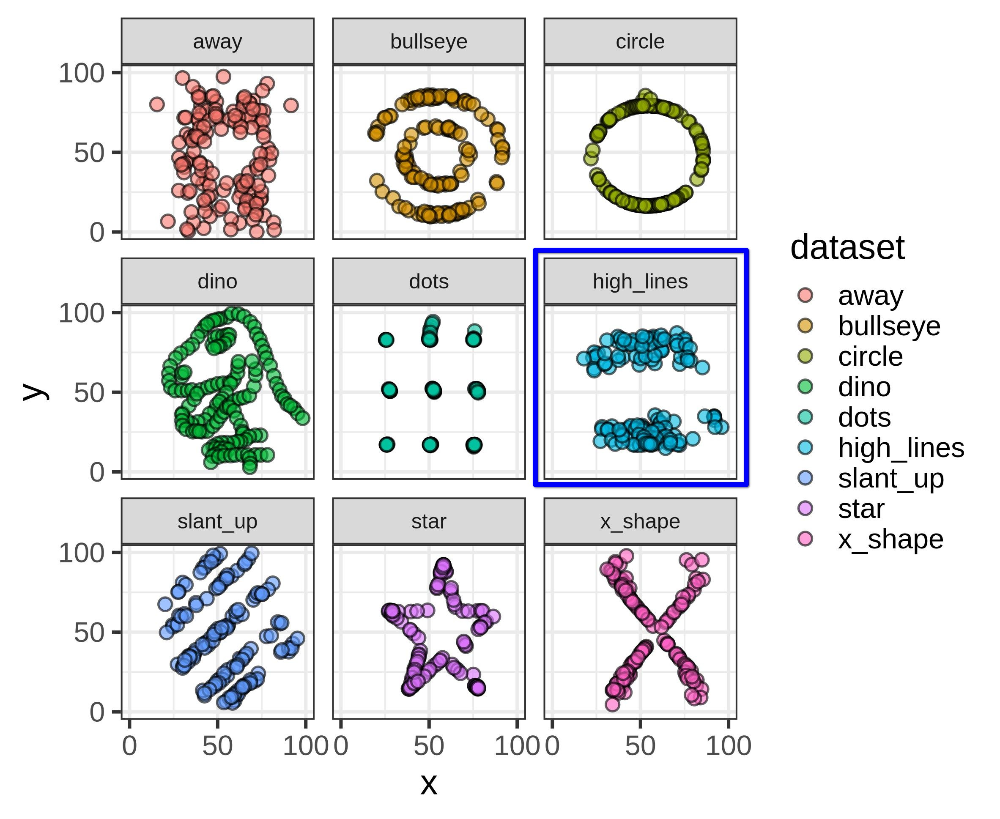
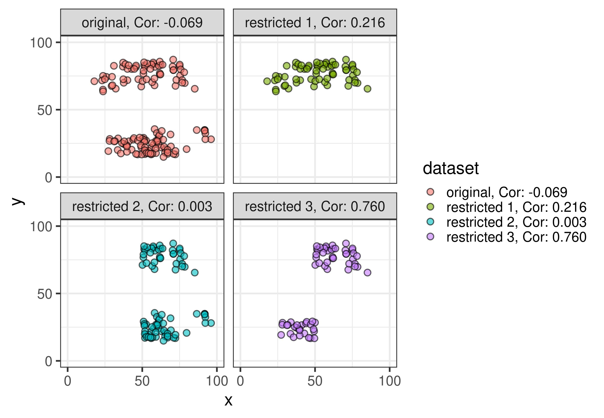
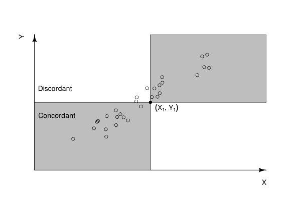
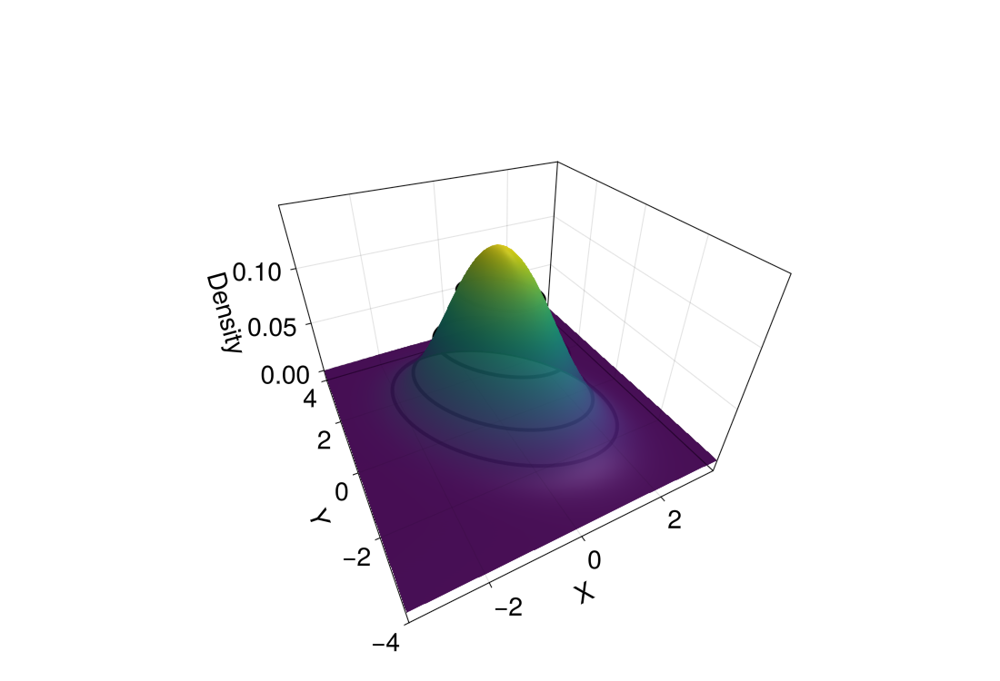
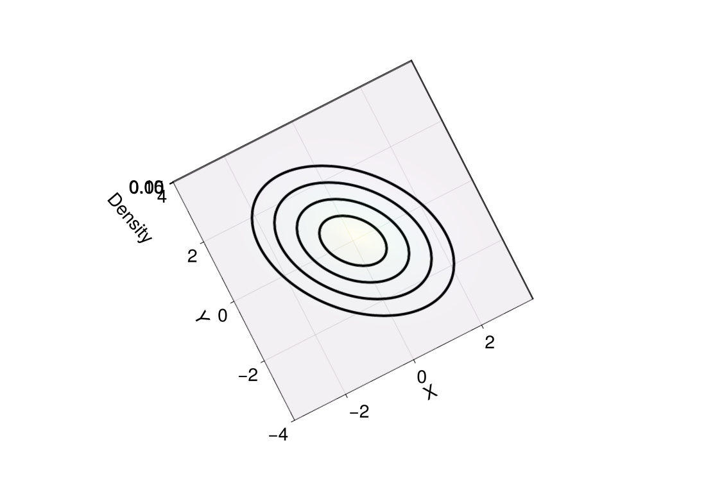

```{r}
knitr::opts_chunk$set(echo = FALSE)
options(knitr.kable.NA = '')
set.seed(1)
library(ggplot2)
library(kableExtra)
library(dplyr)
library(tibble)
library(patchwork)

dtriangle <- function(x, a = -1, b = 1, c = 0) {
  ifelse(x < a, 0,
  ifelse(b < x, 0,
  ifelse(a <= x & x < c, 2 * (x - a) / ((b - a) * (c - a)),
  ifelse(c < x & x <= b, 2 * (b - x) / ((b - a) * (b - c)),
    # x == c
    2 / (b - a)
  ))))
}
toDT <- function(dat, scroll = TRUE, rownames = FALSE) {

  numeric_cols <- if (is.data.frame(dat))
    names(dat)[sapply(dat, is.numeric)]
  else if (is.matrix(dat)) {
    which(apply(dat, 2, is.numeric))
  }

  DT::datatable(
    dat, options = list(searching = FALSE, info = FALSE, paging = FALSE, scrollX = scroll, scrollY = "350px", scrollCollapse = TRUE,autoWidth = TRUE
    ), rownames = rownames) |>
    DT::formatRound(numeric_cols, digits = 2)
}

```

## Today {.unlisted}

[Chapter 5](https://cjvanlissa.github.io/stats12/Chapter3_Correlation.html) and [Chapter 6](https://cjvanlissa.github.io/stats12/probability.html) from the gitbook.


# Bivariate Descriptive Statistics


## What is "Bivariate"?

. . .

Looking at two variables at the same time.

Yes, there is also "trivariate" and more generally, "multivariate".

## Bivariate Descriptive Statistics

- Contingency tables (we talked about these last week)
- Covariance
- Correlation

## Dataset: World Data

```{r}
#| echo: false
#| label: "World dataset"
library(DT)

d <- readRDS("scripts/data/gap2022.rds")
set.seed(42)
nms <- c("Afghanistan", "Angola", "Albania",
         "Belgium", "Denmark", "France", "Germany",
         "USA", "UK" , "Spain", "Italy", "Brazil", "China",
         "Japan", "Netherlands", "Poland", "Austria", "Czech Republic", "Switzerland",
         "Canada")
rand_names_opts <- setdiff(d$name, nms)
rand_names <- c(sample(rand_names_opts, 10), nms)
mydata <- d |> filter(name %in% rand_names)

d0 <- d |> select(name, life_expectancy, fertility) |>
  mutate(
    life_expectancy_m0 = life_expectancy - mean(life_expectancy, na.rm = TRUE),
    fertility_m0 = fertility - mean(fertility, na.rm = TRUE),
    SP = fertility_m0 * life_expectancy_m0
  )

toDT(mydata[-1])

```


::: footer
Source: Data from world bank via <https://www.gapminder.org/data>, CC-BY license
:::

## Dataset: World Data {.small-slide}

::: {.incremental}
- Child mortality: Probability of dying between age 0 - 5 per 1000 babies (percentage).
- Fertility: This is the number of children that would be born to a woman if she were to live to the end of her childbearing years and bear children in accordance  with age-specific fertility rates of the specified year.
- CO2_PCAP: CO2 emissions per capita.
- GDP_PCAP: GDP per capita.
- Life Expectancy: No. years a newborn would live at current mortality rates.
- Daily income: The mean daily household per capita income in 2021 PPP (constant international dollars).
:::

## Fertility vs. Life expectancy

```{r}
#| echo: false
ggplot(d, aes(x = fertility, y = life_expectancy)) +
  geom_point(size = 3, shape = 21, fill = "grey", alpha = .7) +
  labs(x = "Fertility", y = "Life expectancy") +
  theme_bw(base_size = 24)
```


## Last Week: Sum of Squared Distances $SS_x$

$$
SS_x = \sum_{i=1}^{n}(x_i - \bar{x})^2 = \sum_{i=1}^{n}(x_i - \bar{x})(x_i - \bar{x})
$$

. . .

One variable: $\mathrm{deviation} \times \mathrm{deviation} = \mathrm{Variance}$

. . .

Two variables: $x-\mathrm{deviation} \times y-\mathrm{deviation} = \mathrm{Covariance}$


## Covariance: Sum of Products

$$
SP_{xy} = \sum_{i=1}^n \bigl(x_i - \bar{x}\bigr)\bigl(y_i - \bar{y}\bigr)
$$

::: {style="font-size: 70%;"}
Definitions:

- $x$ and $y$: the two variables we're interested in.
- $\bar{x}$: the sample mean of the variable $x$.
- $x_i$: the $i$th observation of the variable.
- $n$ the sample size.
- $\sum_{i=1}^{n}$: the sum from $i$ is 1 to $i$ is $n$.
- $SP_{xy}$ the sum of products between $x$ and $y$.
:::

## Covariance: Sum of Products

::: {style="font-size: 70%;"}
$\overline{\text{Life Expectancy}}$ = `{r} format(mean(d$life_expectancy, na.rm = TRUE), digits = 3)`,
$\overline{\text{Fertility}}$ = `{r} format(mean(d$fertility, na.rm = TRUE), digits = 3)`,
:::

```{r}
#| echo: false
d0 |>
  filter(name %in% rand_names) |>
  toDT()
```

## Covariance: Sum of Products

$SP_{xy}$ = `{r} format(sum(d0$SP, na.rm = TRUE), digits = 3)`. What does this mean?

. . .

```{r}
#| echo: false
ggplot(d, aes(x = fertility, y = life_expectancy)) +
  geom_point(size = 3, shape = 21, fill = "grey", alpha = .7) +
  labs(x = "Fertility", y = "Life expectancy") +
  theme_bw(base_size = 24)
```

## Covariance

$$
S_{xy} = \frac{\sum_{i=1}^n \bigl(x_i - \bar{x}\bigr)\bigl(y_i - \bar{y}\bigr)}{n} = \frac{SP_{xy}}{n}
$$


:::: {.columns}

::: {.column width="70%"}

::: {style="font-size: 70%;"}
Definitions:

- $x$ and $y$: the two variables we're interested in.
- $\bar{x}$: the sample mean of the variable $x$.
- $x_i$: the $i$th observation of the variable.
- $n$ the sample size.
- $\sum_{i=1}^{n}$: the sum from $i$ is 1 to $i$ is $n$.
- $SP_{xy}$ the sum of products between $x$ and $y$.
:::

:::

::: {.column width="30%"}

. . .

$S_{xy}$ = `{r} format(mean(d0$SP, na.rm = TRUE), digits = 3)`.

:::
::::

## Correlation: Standardized Covariance

$$
r_{xy} = \frac{\sum_{i=1}^n \bigl(x_i - \bar{x}\bigr)\bigl(y_i - \bar{y}\bigr)}{ns_xs_y} = \frac{SP_{xy}}{ns_xs_y} = \frac{S_{xy}}{s_xs_y}
$$

:::: {.columns}

::: {.column width="70%"}

::: {style="font-size: 70%;"}
Definitions:

- $x$ and $y$: the two variables we're interested in.
- $\bar{x}$: the sample mean of the variable $x$.
- $x_i$: the $i$th observation of the variable.
- $n$ the sample size.
- $\sum_{i=1}^{n}$: the sum from $i$ is 1 to $i$ is $n$.
- $SP_{xy}$: the sum of products between $x$ and $y$.
- $s_x$: the sample standard deviation of $x$
:::

:::

::: {.column width="30%"}

. . .

$r_{xy}$ = `{r} format(cor(d0$life_expectancy, d0$fertility, use = "complete"), digits = 3)`.

:::

::::

## Correlation: Standardized Covariance

Recall $Z$-scores, $Z_{x_i} = \frac{x_i-\bar{x}}{s_x}$ and $Z_{y_i} = \frac{y_i-\bar{y}}{s_y}$

. . .

$$
\begin{align}
r_{xy} &= \frac{\sum_{i=1}^n \bigl(x_i - \bar{x}\bigr)\bigl(y_i - \bar{y}\bigr)}{ns_xs_y} \\
r_{xy} &= \frac{1}{n}\sum_{i=1}^n \frac{\bigl(x_i - \bar{x}\bigr)}{s_x}\frac{\bigl(y_i - \bar{y}\bigr)}{s_y} \\
r_{xy} &= \frac{1}{n}\sum_{i=1}^n
\underbrace{\frac{\bigl(x_i - \bar{x}\bigr)}{s_x}}_{Z_{x_i}}
\underbrace{\frac{\bigl(y_i - \bar{y}\bigr)}{s_y}}_{Z_{y_i}} \\
r_{xy} &= \frac{1}{n}\sum_{i=1}^n Z_{x_i} Z_{y_i}
\end{align}
$$


## Covariance Matrix

```{r}
d |> select(-geo, -name) |> cov(use = "pairwise.complete.obs") |> as.data.frame() |> toDT(rownames = TRUE)
```


::: {.notes}
point out relations between child mortality and gdp_pcap, life expectancy, daily income
their covariances are all negative but which relation is strongest?
cannot tell due to units.
:::

## Correlation Matrix

```{r}
d |> select(-geo, -name) |> cor(use = "pairwise.complete.obs") |> as.data.frame() |> toDT(rownames = TRUE)
```


## Covariance vs. Correlation

:::: {.columns}

::: {.column width="50%"}
### Covariance
- $-\infty < S_{xy} < \infty$
- unit, $\mathrm{unit}(x) \times \mathrm{unit}(y)$
- covariance of $x$ with $x$ equals variance
- scales with linear transformation of the data (e.g., mm to cm)
- cannot be interpreted without knowing the variances
:::

::: {.column width="50%"}
### Correlation
- $-1 \leq r_{xy} \leq 1$
- no unit
- correlation of $x$ with $x$ equals $1$
- unaffected by changes of units (e.g., cm to mm)
- can be interpreted without knowing the variances
:::

::::

## Limitations

- Throughout, we're often looking at plots of the data
- The only thing that truly conveys all information in the data... are the data themselves
- Looking at raw numbers is typically not informative, hence we use plots

. . .


## Anscombe's Quartet

{fig-align="center"}

::: footer
Source: [Wikipedia](https://en.wikipedia.org/wiki/Anscombe%27s_quartet)
:::

## Anscombe's Quartet

```{r}
sum_anscombe <- read.csv("scripts/sum_anscombe.csv")
kbl(sum_anscombe[,-1], digits = 3)
```

## Datasaurus Dozen

{fig-align="center"}

::: footer
source: <https://jumpingrivers.github.io/datasauRus/>
:::

## Datasaurus Dozen


```{r}
sum_datasaurus <- read.csv("scripts/sum_datasaurus.csv")
kbl(sum_datasaurus[,-1], digits = 3)
```

## Limitations (2)

Some limitations cannot be spotted by looking at a plot!

1. Restricted range
2. Causality

## Restricted range

{fig-align="center"}

## Restricted range

{fig-align="center"}


## Causality

What do these correlations tell us about causality, i.e., which variable _causes_ a change in another?

. . .

Nothing! _Correlation does not imply causation_!


<!-- Wooclap! -->
<!--
Q1: which statements are true?
[c] diagonal element of covariance equals variance
    diagonal element of covariance equals standard deviation
    correlation has the same unit as the variables
[c] correlation can be negative

Q2: which picture shows a positive correlation?

Q3: which statements are true?
[c] correlation measures a nonlinear relation
    diagonal element of covariance equals standard deviation
    correlation has the same unit as the variables
[c] correlation can be negative

-->


# Break {.section-slide .unlisted}

See you in ~10 minutes!


# Transformations


## Example: Wealth

```{r}
#| echo: false
#| fig-align: center
ggplot(d, aes(x = gdp_pcap, y = life_expectancy)) +
  geom_point(size = 3, shape = 21, fill = "grey", alpha = .7) +
  labs(x = "GDP", y = "Life expectancy") +
  ggtitle(sprintf("Cor(GDP, Life expectancy) = %.3f", cor(d$gdp_pcap, d$life_expectancy, use = "pairwise.complete.obs"))) +
  theme_bw(base_size = 24)
```

## What if the relation is not linear?

- Transformations
- Spearman rank correlation
- Kendall's tau


## Transformations

Transformations can make

- the data more normal
- relations more linear

which in turn makes statistics easier.

But, transformations also

- alter the meaning of the data
- are not guaranteed to make things better

## Common transformations

Some we have already seen!

Converting raw to Z scores, is technically a transformation.

. . .

- Log, log10, reciprocal, exp, power, square root

## Common transformations

```{r}
#| echo: false
x <- seq(-2, 2, .01)
fns <- list(
  exp = exp,
  power = \(x) x^2,
  log = log,
  log10 = log10,
  reciprocal = \(x) 1 / x,
  "square root" = sqrt
)
nms <- names(fns)
y <- setNames(nm = nms, lapply(nms, \(nm) fns[[nm]](x)))
lens <- lengths(y)
tib <- tibble(
  x = rep(x, length(y)),
  y = unlist(y, use.names = FALSE),
  transformation = rep(nms, lens)
)
ggplot(tib, aes(x = x, y = y, color = transformation)) +
  geom_line() +
  facet_wrap(~transformation, scales = "free") +
  theme_bw(base_size = 20)

```

## Example: Wealth

```{r}
#| echo: false
#| fig-align: center
ggplot(d, aes(x = gdp_pcap, y = life_expectancy)) +
  geom_point(size = 3, shape = 21, fill = "grey", alpha = .7) +
  labs(x = "GDP", y = "Life expectancy") +
  ggtitle(sprintf("Cor(GDP, Life expectancy) = %.3f", cor(d$gdp_pcap, d$life_expectancy, use = "pairwise.complete.obs"))) +
  theme_bw(base_size = 24)
```

## Example: Wealth

```{r}
#| echo: false
#| fig-align: center
ggplot(d, aes(x = log(gdp_pcap), y = life_expectancy)) +
  geom_point(size = 3, shape = 21, fill = "grey", alpha = .7) +
  labs(x = "Log(GDP)", y = "Life expectancy") +
  ggtitle(sprintf("Cor(Log(GDP), Life expectancy) = %.3f", cor(log(d$gdp_pcap), d$life_expectancy, use = "pairwise.complete.obs"))) +
  theme_bw(base_size = 24)
```

## Example: Wealth

```{r}
#| echo: false
#| fig-align: center
h1 <- hist(d$gdp_pcap, plot = FALSE)
h2 <- hist(log(d$gdp_pcap), plot = FALSE)
g1 <- ggplot(d, aes(x = gdp_pcap))      + geom_histogram(binwidth = h1$breaks[2] - h1$breaks[1]) + ggtitle("Histogram Wealth")      + theme_bw(base_size = 24)+ scale_x_continuous(labels = function(x) x / 1e5)
g2 <- ggplot(d, aes(x = log(gdp_pcap))) + geom_histogram(binwidth = h2$breaks[2] - h2$breaks[1]) + ggtitle("Histogram Log(Wealth)") + theme_bw(base_size = 24)
g1 + g2
```


## Spearman rank correlation

Pearson correlation between the rank values of those two variables


```{r}
#| echo: false
d |>
  select(gdp_pcap, life_expectancy)|>
  mutate(
    rank_gd = rank(gdp_pcap),
    rank_life_expectancy = rank(life_expectancy)
  ) |>
  select(gdp_pcap, rank_gd, life_expectancy, rank_life_expectancy)|>
  head(20) |>
  toDT()
```

<!--
## Kendall's tau

{fig-align="center" width="50%"}

Take two observations  $x_i, y_i$ and $x_j, y_j$.
These are called _concordant_ if either

- $x_i > x_j$ AND $y_i > y_j$, or
- $x_i < x_j$ AND $y_i < y_j$

and called _disconcordant_ otherwise.

$$
\tau = \frac{\text{(\# concordant pairs)} - \text{(\# disconcordant pairs)}}{n}
$$


::: footer

$\tau$ is the Greek letter "tau".

Source: <https://en.wikipedia.org/wiki/Kendall_rank_correlation_coefficient>
:::
-->

## Example: Wealth

- Pearson Correlation: `{r} format(cor(d$gdp_pcap, d$life_expectancy, use = "pairwise.complete.obs"), digits = 3)`
- Spearman rank Correlation: `{r} format(cor(d$gdp_pcap, d$life_expectancy, use = "pairwise.complete.obs", method = "spearman"), digits = 3)`
- Kendall's Tau: `{r} format(cor(d$gdp_pcap, d$life_expectancy, use = "pairwise.complete.obs", method = "kendall"), digits = 3)`
```{r}
#| echo: false
#| fig-align: center
ggplot(d, aes(x = gdp_pcap, y = life_expectancy)) +
  geom_point(size = 3, shape = 21, fill = "grey", alpha = .7) +
  labs(x = "GDP", y = "Life expectancy") +
  theme_bw(base_size = 24)
```

## Example: Wealth

- Pearson Correlation: `{r} format(cor(log(d$gdp_pcap), d$life_expectancy, use = "pairwise.complete.obs"), digits = 3)`
- Spearman rank Correlation: `{r} format(cor(log(d$gdp_pcap), d$life_expectancy, use = "pairwise.complete.obs", method = "spearman"), digits = 3)`
- Kendall's Tau: `{r} format(cor(log(d$gdp_pcap), d$life_expectancy, use = "pairwise.complete.obs", method = "kendall"), digits = 3)`
```{r}
#| echo: false
#| fig-align: center
ggplot(d, aes(x = log(gdp_pcap), y = life_expectancy)) +
  geom_point(size = 3, shape = 21, fill = "grey", alpha = .7) +
  labs(x = "Log(GDP)", y = "Life expectancy") +
  theme_bw(base_size = 24)
```


## Sample statistics and Population Estimators


- Sample statistics describe the sample.
- What we want to describe is the _population_.
- For this reason, sample statistics are often "adjusted":

. . .

:::: {.columns}

::: {.column width="50%"}
### Sample
- Variance divides by $n$
- Covariance divides by $n$
:::

::: {.column width="50%"}
### Estimator
- Variance divides by $n - 1$
- Covariance divides by $n - 1$
:::

::::

Intuition: We "used" one observation to compute the sample mean and thus divide by $n - 1$.

Note:

- Variance and covariance change when we use $n-1$ to estimate population quantities
- Correlation does not change, because the denominator cancels.

## Drawbacks of Descriptive Statistics

At its core, statistics tries to _reduce_ the information in the full dataset into something smaller

- (+) This makes it possible to understand large datasets
- (-) This loses information along the way

. . .

Example: **IF** the data are normally distributed then the mean and variance describe the entire distribution.

# Bivariate Distributions

## Normal distribution

::: {style="font-size: 90%;"}
Last Week: Sample mean and SD correspond to the population model $N(\mu_x, \sigma_x)$
:::

. . .

Now: two sample means, $\bar{x},\bar{y}$, two SDs, $s_x,s_y$, a correlation $r_{xy}$ correspond to a bivariate normal model:

$$
X, Y \sim N(\underbrace{\mu_x, \mu_y}_{\text{mean}}, \underbrace{\sigma_x, \sigma_y, \rho}_{\text{covariance}})
$$

The bivariate normal distribution has five parameters:

$$
\begin{align}
\mu_x &:\text{mean of X}\quad &&\sigma_x :\text{sd of X}\\
\mu_y &:\text{mean of Y}\quad &&\sigma_y :\text{sd of Y}\\
& \quad&&\rho :\text{correlation}
\end{align}
$$

## {background-video="scripts/bvn-3d-to-contour.mp4" background-video-muted="true" background-size="contain" background-video-loop=true}

## These are the same picture {style="overflow-x: hidden;"}


{          .absolute top=200 left=0   width="600"}
{.absolute top=200 left=500 width="600"}


## Bivariate Normal distribution



## Continuous Distributions

Last week we examined discrete probability distributions:

- joint, marginal, and conditional.

For continuous probability distributions the exact counterparts exist.

## Marginal Distribution

If we ignore $Y$, or have not observed it, what is the distribution of $X$?

. . .

Conveniently, if

$$
X, Y \sim N(\underbrace{\mu_x, \mu_y}_{\text{mean}}, \underbrace{\sigma_x, \sigma_y, \rho}_{\text{(Co)Variance}})
$$

then the marginal distributions are
$$
X \sim N(\mu_x, \sigma_x), \quad Y \sim N(\mu_y, \sigma_y)
$$


## Conditional Distribution

What if we do know $Y$?

## Conditional Distribution



## Conditional Distribution

If $\rho = 0$ then knowing Y does not tell us anything about X.

They are _independent_.

Independence: knowing the outcome or value of one variable or event provides no information about the probability or outcome of another.

This is a special property of the bivariate normal distribution, it does _not_ hold in general that $\rho = 0$ (or $r = 0$) implies independence.

## Multivariate Normal distribution

For $p$ variables we have:
$$
\mathbf{\mu} = \begin{bmatrix}
\mu_1 \\
\mu_2 \\
\mu_3 \\
\vdots \\
\mu_p
\end{bmatrix}\quad
\mathbf{\Sigma} = \begin{bmatrix}
\sigma_1^2                & \sigma_1\sigma_2\rho_{12} &\sigma_1\sigma_3\rho_{13}  &\cdots &\sigma_1\sigma_p\rho_{1p}\\
\sigma_2\sigma_1\rho_{21} & \sigma_2^2                &\sigma_2\sigma_3\rho_{23}  &\cdots &\sigma_2\sigma_p\rho_{2p}\\
\sigma_3\sigma_1\rho_{31} & \sigma_3\sigma_2\rho_{32} & \sigma_3^2                &\cdots &\sigma_3\sigma_p\rho_{3p}\\
\vdots                    & \vdots                    & \vdots                    &\ddots &\vdots \\
\sigma_p\sigma_1\rho_{p1} & \sigma_p\sigma_2\rho_{p2} & \sigma_p\sigma_3\rho_{p3} &\cdots &\sigma_p^2
\end{bmatrix}
$$

- No more picture
- If $\rho_{ij} = 0$ then variables $i$ and $j$ are independent

## Summary

- Covariance and correlation summarize the association between two variables.
- Transformations and rank correlations may help when the relation is nonlinear.
- The bivariate normal distribution describes the joint, marginal, conditional distributions and independence.