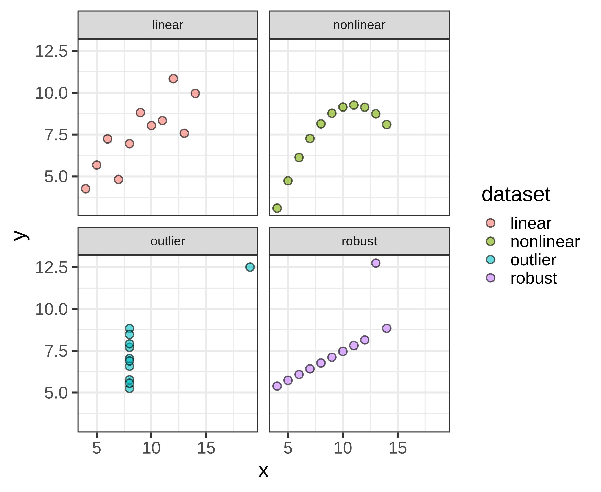
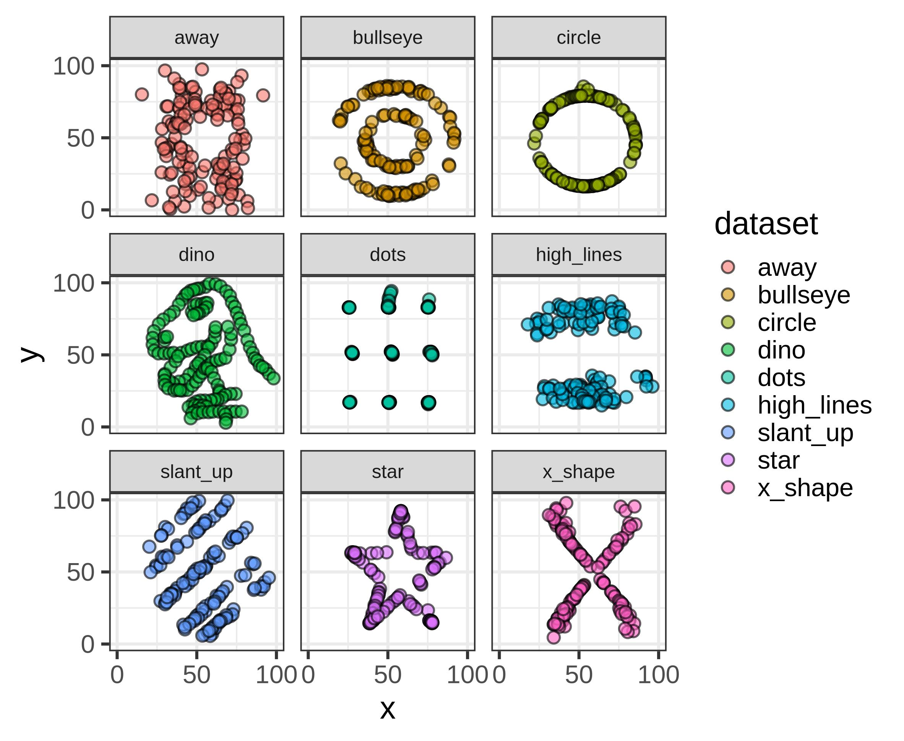

```{r}
knitr::opts_chunk$set(echo = FALSE)
options(knitr.kable.NA = '')
set.seed(1)
library(ggplot2)
library(kableExtra)

library(ggplot2)
library(tibble)

dtriangle <- function(x, a = -1, b = 1, c = 0) {
  ifelse(x < a, 0,
  ifelse(b < x, 0,
  ifelse(a <= x & x < c, 2 * (x - a) / ((b - a) * (c - a)),
  ifelse(c < x & x <= b, 2 * (b - x) / ((b - a) * (b - c)),
    # x == c
    2 / (b - a)
  ))))
}


```

## Today {.unlisted}

[Chapter 5](https://cjvanlissa.github.io/stats12/Chapter3_Correlation.html) and [Chapter 6](https://cjvanlissa.github.io/stats12/probability.html) from the gitbook.


# Bivariate Descriptives Statistics


## What is "Bivariate"?

. . .

yes, there is also "trivariate" and more generally, "multivariate".

## Bivariate Descriptives Statistics

- Contingency tables (we talked about these last week)
- Covariance
- Correlation

## Limitations

- Throughout, we're often looking a plots of the data
- The only thing that truly conveys all information in the data... are the data themselves
- Looking at raw numbers is typically not informative, hence we use plots

##Anscombe's Quartet

{fig-align="center"}

::: footer
Source: [Wikipedia](https://en.wikipedia.org/wiki/Anscombe%27s_quartet)
:::

## Anscombe's Quartet

```{r}
sum_anscombe <- read.csv("scripts/sum_anscombe.csv")
kbl(sum_anscombe, digits = 3)
```

## Datasaurus Dozen

{fig-align="center"}

::: footer
source: <https://jumpingrivers.github.io/datasauRus/>
:::

## Datasaurus Dozen


```{r}
sum_datasaurus <- read.csv("scripts/sum_datasaurus.csv")
kbl(sum_datasaurus, digits = 3)
```

## Drawbacks of statistics

At its core, statistics tries to _reduce_ the information in the full dataset into something smaller

- (+) This makes it possible to understand large datasets
- (-) This looses information along the way

. . .

Example: **IF** the data are normally distributed then the mean and variance describe the entire distribution.

# Bivariate Distributions

## Bivariate Distributions

If we have bivariate descriptives are the sample estimates of population statistics of bivariate distributions.

## Bivariate Normal distribution




## Multivariate Normal distribution

No more picture

## Aside: The Central Limit Theorem

## What if the world is not normal?

- Kendall's tau
- Spearman rank correlation

. . .

Both are less "powerful" than the Pearson correlation _if the data are sufficiently normal_.
