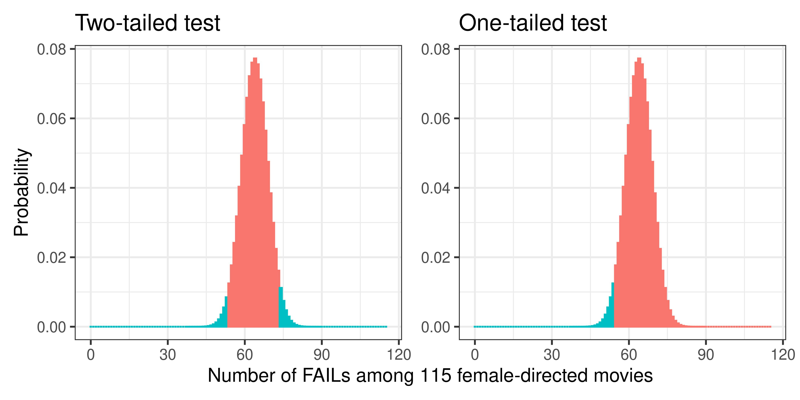

## Today {.unlisted}

[Chapter 7](https://cjvanlissa.github.io/stats12/samplingdistribution.html) and [Chapter 9](https://cjvanlissa.github.io/stats12/testing.html) from the gitbook.

$$
\newcommand{\hypo}{\mathcal{H}}
$$

## Learning Goals:

- What are hypotheses?
- What is the logic behind Null Hypothesis Significance Testing (NHST)?
- What is a sampling distribution?
- How do we test hypotheses?
- What is statistical power?

# Hypothesis Testing

## Hypotheses

What are hypotheses?

. . .

Examples:

::: {.column width="60%"}

- All swans are white
- A film director's gender has no impact on whether a movie passes the Bechdel test
- This medicine helps patients recover faster than no medicine

:::

{.absolute top=50 right=100 width="300" height="300"}

## Falsification

- We typically cannot "confirm" or "validate" hypotheses.
- We can only reject them.
- If we observe 100 white swans, this does not tell us that all swans are white.
- If we observe one black swan, we can reject the hypothesis that all swans are white.

{fig-align="right"  width="500" height="500" style="overflow-y: visible;"}

## Falsification - Logic

1. Hypothesis/ Statement: All swans are white
2. Data: A black swan
3. Implication: Not all swans are white
4. Conclusion: Reject the hypothesis

## Falsification - Requirements

A hypothesis must be testable and capable of being proven false.

. . .

Is "God exists" a valid hypothesis?

. . .

No, because we cannot (scientifically) test the existence of god.

This has nothing to do with whether a claim is true or not.
For it to be a hypothesis it must be _testable_.

## Vulcan

{.absolute top=80 left=20 width="1000"}

::: notes

- Celestial bodies between Mercury and the sun had been hypothesized, searched for, and were even claimed to have been observed, for centuries.
- "Observed" for the first time in 1611 by German astronomer Christoph Scheiner
- Amateur astronomer Capel Lofft's also observed of 'an opaque body traversing the sun's disc' on 6 January 1818
- In 1840 François Arago, the director of the Paris Observatory, suggested to mathematician Urbain Le Verrier that he would work out Mercury's orbit around the Sun.
- The goal of the study was to construct a model based on Isaac Newton's laws of motion and gravitation.
- A detailed presentation published in 1845, which would be tested during a transit of Mercury across the face of the Sun in 1848.
- Predictions from Le Verrier's model failed to match the observations.
- Le Verrier continued his work
- In 1859 he published a more thorough study of Mercury's motion. That was based on a series of observations of the planet and 14 transits across the sun.
- The study's rigor meant that any differences between the motion predicted and what was observed would point to the influence of an unknown factor.
- Le Verrier suggested that the mismatch between the observations and his model's predictions could be explained by the presence of some unidentified object inside the orbit of Mercury.
- This was credible, because Le Verrier had accurately predicted the existence Neptune in 1846.
- Le Verrier received a letter from Lescarbault who said he observed a possible planet.
- Lescarbault described in detail how, on 26 March 1859, he observed a small black dot on the face of the Sun.
- On 2 January 1860, Le Verrier announced the discovery of the new planet with the proposed name from mythology, "Vulcan".
- Tons of Attempts to confirm the discovery followed and Le Verrier received numerous reports from amateur astronomers.
- In 1915, Einstein's theory of relativity, provided a new approach to understanding gravity entirely differently from Newton's classical mechanics.
- It showed that the mismatch between Le Verrier's model and Mercury's orbit were the results of the curvature of spacetime caused by the mass of the Sun.

- A surprising observation does not automatically tell us which part of our explanation is wrong.
- The Mercury anomaly could be explained by an unseen planet, measurement problems, or a failure of the underlying theory of gravity.
- Scientists therefore generate competing, testable explanations and try to rule them out.
- Vulcan ultimately failed; Einstein’s theory explained Mercury’s orbit without the extra planet.
- Scientific progress comes from explanations surviving serious attempts at falsification—not from a single confirming observation.
- This becomes harder with noisy data: apparent discrepancies can arise simply through chance. That is the problem NHST is designed to address.

:::

## From Hypotheses to Theories

Theories are the hypotheses that survive despite serious attempts to refute them.

## Null Hypothesis Significance Testing

In our _sample_ we observed that movies with male directors fail the Bechdel test more often than movies with female directors.

But what does this tell us about the population?

<!-- TODO insert Bechdel data from previous lecture -->
|              |        | Director Gender |             |           |
|-------------:|:------:|:---------------:|:-----------:|-----------|
| Test         | Female | Male            | Mixed/other | Total row |
| FAIL         | 21     | 957             | 13          | 991       |
| PASS         | 94     | 689             | 20          | 803       |
| Total column | 115    | 1646            | 33          | 1794      |

## Null Hypothesis Significance Testing

We expect male and female directors to differ.

But we test the opposite:

- $\hypo_0$: male and female directors pass equally often.
- Assume $\hypo_0$ is true.
- Ask: how surprising are our observed data under $\hypo_0$?
- $p = P(\text{data at least this extreme} \mid \hypo_0)$
- If $p < \alpha$, reject $\hypo_0$.

. . .

This is _falsification under uncertainty_.

## Falsification under Uncertainty {.small-slide}

There are three options:

  1. The data suggest to reject $\hypo_0$
  2. The data are not informative to reject or accept $\hypo_0$
  3. The data suggest to accept $\hypo_0$

. . .

NHST allows us to distinguish **1** from **not 1**:

. . .

- $p = P(\text{Data at least this extreme} | \hypo_0)$
- $p < \alpha \rightarrow \text{reject } \hypo_0$.
- $p \geq \alpha \rightarrow \text{do not reject } \hypo_0$.

. . .

Failing to reject $\hypo_0$ is not evidence for $\hypo_0$!

## Incorrect Rejections: Error Rates

Even if $\hypo_0$ is true, unusual samples sometimes occur.

$\alpha$ controls how often we are willing to falsely reject $\hypo_0$.

- In the social sciences, usually $\alpha = .05$. When $\hypo_0$ is true, we falsely reject it in 1 out of 20 studies.
- Smaller $\alpha$ demands stronger evidence before rejection.
- For example, physics uses a 5 sigma rule, $\alpha = P(Z>5) = 0.000000287$. A true $\hypo_0$ is falsely rejected in 1 out of 3.5 million studies.

. . .

This is a strength of NHST: Sampling uncertainty makes errors unavoidable, but we can control their long-run rate.

## What a $p$-value Does *Not* Tell Us

The logic doesn't necessarily hold!

::: {style="font-size: 80%;"}
- $\hypo_0$: Piet is Dutch.
- Observation: Piet is a member of the Tweede Kamer (parlement).
- $P(\text{Tweede Kamerlid}\mid\text{Dutch})$ is extremely small.
- An NHST-like argument says: That observation would be extremely unlikely if Piet were Dutch, so reject $\hypo_0$.

:::

Yet the observation is obviously evidence for Piet being Dutch rather than against it.

. . .

The problem: $P(\text{data}\mid\hypo_0)\neq P(\hypo_0\mid\text{data})$

NHST computes the left-hand side.

## NHST Summary

1. Define $\hypo_0$ and pick $\alpha$.
2. Assume $\hypo_0$ is true.
3. Ask: how surprising are our observed data under $\hypo_0$?
4. $p = P(\text{data at least this extreme} \mid \hypo_0)$
5. If $p < \alpha$, reject $\hypo_0$.

. . .

In (3), NHST asks: "how surprising are our observed data if $\hypo_0$ were true?"

But how do we answer that question?

# Sampling Distributions

## Sampling Distributions

Recall the Bechdel-test dataset:

|              |        | Director Gender |           |
|-------------:|:------:|:---------------:|-----------|
| Test         | Female | Male            | Total row |
| FAIL         | 21     | 957             | 978       |
| PASS         | 94     | 689             | 783       |
| Total column | 115    | 1646            | 1761      |

We observed that female-directed movies fail less often than male-directed movies.

. . .

Could a difference this large arise simply because of _sampling variability_?

## Sampling Distributions

Assume the null hypothesis is true:

- $\hypo_0$: Director gender and Bechdel-test outcome are unrelated.

Keep the totals fixed:

::: {style="font-size: 90%;"}
- 1761 movies
- 115 female-directed and 1646 male-directed
- 978 FAIL and 783 PASS
:::

. . .

Under $\hypo_0$, the 978 FAILs occur randomly across the 1761 movies.

For every hypothetical repetition, record:

- How many of the 115 female-directed movies FAIL?

## Sampling Distributions

If $\hypo_0$ is true, we expect the female-directed movies to have approximately the same failure rate as the complete sample.

The expected number of FAILs is therefore

$$
\text{No. Female} \times \frac{\text{No. FAILs}}{\text{No. Movies}} =  115 \times \frac{978}{1761} \approx 63.9.
$$

. . .

But because of sampling variability, we would not observe exactly 64 every time.

Sometimes we might observe 60, sometimes 70, sometimes 50, ...

The distribution of these hypothetical outcomes is a _sampling distribution_.

::: {.notes}

More literally, the sampling distribution is how we'd expect things to look like in our sample, assuming a particular hypothesis or model is true.

:::

## Sampling Distributions: Example

. . .

The observed no. FAILs lies far in the tail of the distribution.

## From Sampling Distributions to $p$-values

The $p$-value asks:

> Assuming $\hypo_0$ is true, how probable is a result at least as extreme as the one we observed?

Our observed value was $X_\text{observed} = 21$.

Under $\hypo_0$, observing _21 or fewer_ FAILs among female-directed movies has probability $2.38 \times 10^{-17} \approx 0.\underbrace{0000000000000000}_{16 \text{ zeros}}238$

<!-- phyper(21, m = 978, n = 783, k = 115) -->

This is very unlikely, if $\hypo_0$ is true.

## Alternative Hypothesis

So far we've only stated our null hypothesis.

- $\hypo_0$: Director gender and Bechdel-test outcome are unrelated.

. . .

- $\hypo_{1a}$: Director gender and Bechdel-test outcome are related.
  + $P(\text{PASS} | \text{Female}) \neq P(\text{PASS} | \text{Male})$

. . .

- $\hypo_{1b}$: Female directors pass the Bechdel-test more often than Male directors
  + $P(\text{PASS} | \text{Female}) > P(\text{PASS} | \text{Male})$

. . .

$\hypo_{1a}$ is an _undirected_ hypothesis, while $\hypo_{1b}$ is directed.

This matters for the question we ask from the sampling distribution!

## One tailed vs. Two tailed testing

The alternative hypothesis determines the tail area of the sampling distribution.

{fig-align="center"}

. . .

For many symmetric continuous tests, the two-tailed $p$$-value is twice the corresponding one-tailed $p$-value.

::: {.notes}

p-value from before was based on a one-tailed result.

:::

## Sampling Distributions

Previous weeks, we observed:

$x_1, x_2, \dots, x_n$

. . .

$x_{n+1}, x_{n+2}, \dots, x_{2n}$

. . .

$x_{2n+1}, x_{2n+2}, \dots, x_{3n}$

. . .

etc.

. . .

And eventually the empirical distribution of these $x$ approaches the population distribution, say $\mathcal{N}(\mu, \sigma^2)$.

## Sampling Distributions

Now we examine:

$x_1, x_2, \dots, x_n$, compute $\bar{x}_1$

. . .

$x_{n+1}, x_{n+2}, \dots, x_{2n}$, compute $\bar{x}_2$

. . .

$x_{2n+1}, x_{2n+2}, \dots, x_{3n}$, compute $\bar{x}_3$

. . .

repeat and for each sample $i$, compute the sample mean $\bar{x}_i$.

What is the distribution of $\bar{x}_1, \bar{x}_2, \dots$?

. . .

- Each sample mean consists of _finite_ observations
- The sampling distribution describes how these behave if we'd repeat this experiment infinitely many times
- We look where our sample statistic falls in this distribution

## Sampling Distributions

In general, the _sampling distribution_ is:

> The distribution of a statistic across hypothetical repeated samples from the same population.

Examples of statistics include:

::: {style="font-size: 90%;"}

- a proportion
- a correlation
- a sample mean, $\bar{x}$
- a difference between means

:::
. . .

For NHST, we care about the sampling distribution _assuming $\hypo_0$ is true_.

## Sampling Distributions

For our Bechdel example, we could derive the sampling distribution exactly.

But suppose instead we observe

$$
x_1, x_2, \dots, x_n
$$

and are interested in the sample mean

$$
\bar{x}.
$$

What does the sampling distribution of $\bar{x}$ look like?

. . .

Deriving the exact sampling distribution for every possible population distribution would be difficult.

Fortunately, there is a remarkably general result:

# Central Limit Theorem

## Central Limit Theorem

Suppose $x_1, x_2, \dots, x_n \overset{\mathrm{iid}}{\sim} \mathcal{D}(\mu, \sigma^2, \dots)$.

Then, as $n$ becomes large,

$$
\bar{x} = \frac{1}{n}\sum_{i=1}^n x_i
\approx \mathcal{N}\left(\mu, \frac{\sigma^2}{n}\right).
$$

::: {style="font-size: 70%;"}
This holds for all population distributions $\mathcal{D}$, as long as they have a finite mean $\mu$ and variance $\sigma^2$.

Definitions:

- $\overset{\mathrm{iid}}{\sim}$ means _independent_ and _identically distributed_.
- _independent_: "knowing the outcome or value of one variable or event provides no information about the probability or outcome of another.", i.e., observing $x_2$ has no influence on what $x_7$.
- _identically distributed_: All the $x_i$ come from the same population distribution
:::

## Central Limit Theorem

Suppose $x_1, x_2, \dots, x_n \overset{\mathrm{iid}}{\sim} \mathcal{D}(\mu, \sigma^2, \dots)$.

Then, as $n$ becomes large,

$$
\bar{x} = \frac{1}{n}\sum_{i=1}^n x_i
\approx \mathcal{N}\left(\mu, \frac{\sigma^2}{n}\right).
$$

Here, $\sigma_{\bar{x}} = \frac{\sigma}{\sqrt{n}}$ is known as the _standard error_.

. . .

Note that $\sigma_{\bar{x}}$ goes to 0 as n grows.

This indicates that the sample mean converges to the population mean as the no. samples increases.

## The sampling distribution of the mean



## Why the Central Limit Theorem matters

The impact of $\bar{x} \sim \mathcal{N}\left(\mu, \frac{\sigma^2}{n}\right).$ is huge!

Sums and averages are all around us. For example:

::: {style="font-size: 80%;"}

- In educational science, we study at the performance of pupils.
  + Even though grades are scored 1 - 10, we examine the sum, so CLT applies
- fMRI machines' raw data are voxels (3D pixels) of the brain.
  + Preprocessing steps involve averaging and smoothing the data across multiple voxels. CLT applies.
- We often study proportions, such as the proportion of movies that pass the Bechdel test.
  + Each response can be coded as $x_i = 0$ or $x_i = 1$.
  + The proportion is the average: $\hat{p} = \frac{1}{n}\sum_i x_i$.
  + Therefore, for sufficiently large $n$, $\hat{p}$ is approximately normally distributed.

:::

::: {.notes}
- For the grades example, mention that already at the binary item level this applies.
:::

## Central Limit Theorem -- Addendum

Sometimes, we can derive the sampling distribution _exactly_.

Assume $x_1, x_2, \dots, x_n \overset{\mathrm{iid}}{\sim} \mathcal{N}(\mu, \sigma^2)$.

- Then $\frac{\bar X-\mu}{S/\sqrt n} \sim t_{n-1}$.
- But as $n$ tends to $\infty$, $t_{n-1}$ tends to $\mathcal{N}(0,1)$.

. . .

So the CLT still applies, but when available we use more precise results for the sampling distribution.

. . .

Examples are the $t$-distribution, $F$-distribution, $\chi^2$-distribution.

Some of these we'll revisit in the second half of the course.

## Sampling Distribution: Summary

Recall NHST:

::: {style="font-size: 80%;"}

1. Define $\hypo_0$ and pick $\alpha$.
2. Assume $\hypo_0$ is true.
3. Ask: how surprising are our observed data under $\hypo_0$?
4. $p = P(\text{data at least this extreme} \mid \hypo_0)$
5. If $p < \alpha$, reject $\hypo_0$.

:::

. . .

6. The sampling distribution tells us how unusual our observed statistic is under $\hypo_0$
7. The Central Limit Theorem gives a very practical approximation to the sampling distribution

# Statistical Power

::: {.notes}

So far, we have asked what happens when H0 is true.
Power asks the complementary question: what happens when H0 is false?

:::

## Statistical Power

$\alpha$ is the Type-I error rate: The probability of rejecting a true $\hypo_0$.

. . .

$\beta$ is the Type-II error rate: The probability of failing to reject a false $\hypo_0$.

$1 - \beta$ is the power: The probability of rejecting a false $\hypo_0$.

## Statistical Power

|                       | $H_0$ false                         | $H_0$ true            |
| ---------------------:| ----------------------------------- | --------------------- |
| Reject $H_0$          | Correct rejection / power $1-\beta$ | Type I error $\alpha$ |
| Do not reject $H_0$   | Type II error $\beta$               | Correct non-rejection |

## Statistical Power: Demo

Sampling distributions under $\hypo_0$ and $\hypo_1$



## Statistical Power: Summary

- $\alpha$ is the Type-I error rate: The probability of rejecting a true $\hypo_0$.
- $\beta$ is the Type-II error rate: The probability of failing to reject a false $\hypo_0$.
- power ($1 - \beta$) is the probability of rejecting a false $\hypo_0$.
  + Larger effects are easier to detect.
  + A larger sample size increases the power to detect a given effect.
  + A larger $\alpha$ increases the power, but also increase the type-I error rate.

## Addendum: Contingency test

We only count FAILs among female-directed movies. Why?

If we keep the row and column totals fixed, we have only one unknown:

|              |           | Director Gender   |           |
|-------------:|:---------:|:-----------------:|-----------|
| Test         | Female    | Male              | Total row |
| FAIL         | $X$       | $978 - X$         | $978$     |
| PASS         | $115 - X$ | $783 - (115 - X)$ | $783$     |
| Total column | $115$     | $1646$            | $1761$    |

If $X = 21$, $21$ female-directed movies FAIL, then $978−21=957$ male-directed movies must FAIL.

Thus it does not matter what gender we examine, the results would be identical.

