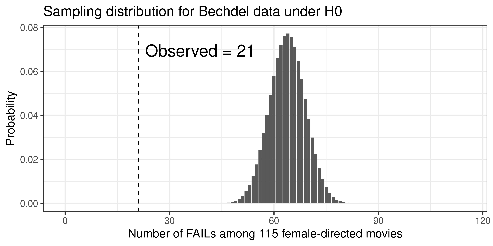
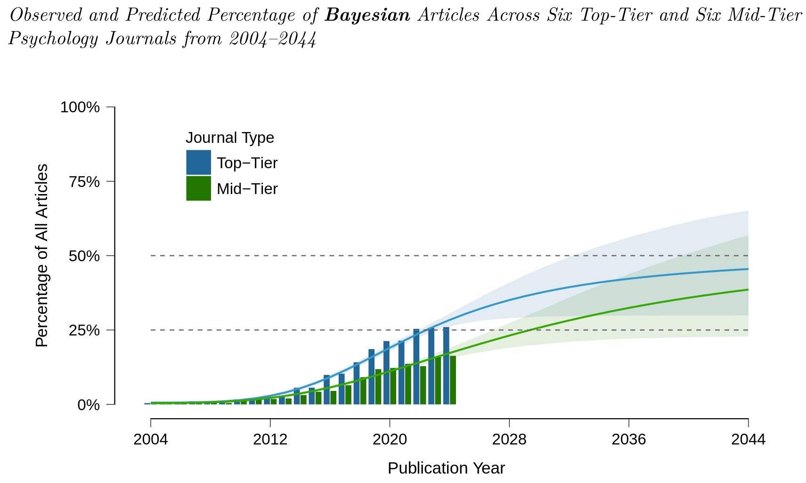
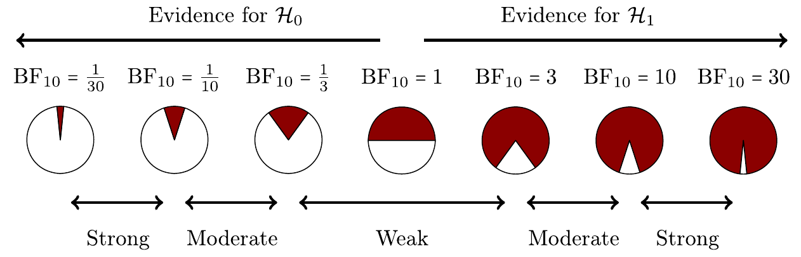

## Today {.unlisted}

<!--

TODO:

fix and reupload lecture 2.

slide on conditional probability is wrong!

 -->

[Chapter 7](https://cjvanlissa.github.io/stats12/samplingdistribution.html) and [Chapter 9](https://cjvanlissa.github.io/stats12/testing.html) from the gitbook.

The information about Bayes theorem, and Bayesian inference is not in the gitbook.

$$
\newcommand{\hypo}{\mathcal{H}}
\newcommand{\and}{\,\&\,}
\newcommand{\nnot}{\mathrm{not}}
\newcommand{\data}{\mathrm{data}}
$$

## Learning Goals

- Understand and apply Bayes theorem
- Understand the conceptual idea of Bayesian inference
- Can list differences between frequentist and Bayesian inference

# Null Hypothesis Significance Testing

## Recap NHST (i)

::: {style="font-size: 80%;"}

1. Define $\hypo_0$ and pick $\alpha$.
2. Assume $\hypo_0$ is true.
3. Ask: how surprising are our observed data under $\hypo_0$?
4. $p = P(\text{data at least this extreme} \mid \hypo_0)$
5. If $p < \alpha$, reject $\hypo_0$.
6. The sampling distribution tells us how unusual our observed statistic is under $\hypo_0$
7. The Central Limit Theorem gives a very practical approximation to the sampling distribution

:::

## Bechdel-test Data

|              |        | Director Gender |           |
|-------------:|:------:|:---------------:|-----------|
| Test         | Female | Male            | Total row |
| FAIL         | 21     | 957             | 978       |
| PASS         | 94     | 689             | 783       |
| Total column | 115    | 1646            | 1761      |

## Recap NHST (ii)

::: {style="font-size: 80%;"}

1. $\hypo_0$: Director gender and Bechdel-test outcome are unrelated. $\alpha = 0.05$.
2. Assume $\hypo_0$ is true.
3. Ask: how surprising are our observed data under $\hypo_0$?
    + Given, 1761 movies, 115 female-directed and 1646 male-directed, 978 FAIL and 783 PASS,
    + how surprising are 21 FAILs by female directors?
4. $p = P(\text{data at least this extreme} \mid \hypo_0) = 0.0000000000000000238$
5. If $p < \alpha$, reject $\hypo_0$.
    + $p < 0.05$, thus reject.

:::

## Recap NHST (iii)

## Recap NHST (iv)

- We reject or not reject $\hypo_0$
- Not rejecting $\hypo_0$ is not evidence for $\hypo_0$

## Recap Central Limit Theorem

Suppose $x_1, x_2, \dots, x_n \overset{\mathrm{iid}}{\sim} \mathcal{D}(\mu, \sigma^2, \dots)$.

Then, as $n$ becomes large,

$$
\bar{x} = \frac{1}{n}\sum_{i=1}^n x_i
\approx \mathcal{N}\left(\mu, \frac{\sigma^2}{n}\right).
$$

Here, $\sigma_{\bar{x}} = \frac{\sigma}{\sqrt{n}}$ is known as the _standard error_.

## Confidence Intervals

The $95\%$ confidence interval is obtained by:
$$
\bar{x} \pm Z_{95\%}\mathrm{SE}_{\bar{x}}
$$
where $Z_{95\%}$ is the 97.5th percentile of the standard normal
distribution: $P(Z \le Z_{95\%}) = 0.975,$ so $Z_{95\%} = 1.96$.

Example: $\bar{x} =1.23$, $\mathrm{SE}_{\bar{x}} = 0.5$, $95\% \mathrm{CI} = [1.23 - 1.96 \times 0.5, 1.23 + 1.96 \times 0.5] = [0.25, 2.21]$.

Definition:

If we repeat _the experiment_ infinitely many times and compute a 95% confidence interval each time, then 95% of those intervals will contain the "true" population mean.

## Confidence Intervals

The $q\%$ confidence interval is obtained by:
$$
\bar{x} \pm Z_{q\%}\mathrm{SE}_{\bar{x}}
$$
where $Z_{q\%}$ is

$$
P(Z \le Z_{q\%})
=
1-\frac{1-q/100}{2}.
$$

# Bayes Theorem

## Recap Probability Theory

- Joint probability: $P(\text{FAIL} \,\&\, \text{FEMALE})$
- Marginal probability: $P(\text{FAIL})$
- Conditional probability: $P(\text{FAIL} \mid \text{FEMALE})$

## Probability Theory Recap

::: {style="font-size: 80%;"}
The Bechdel-test data raw counts:
:::

|              |        | Director Gender |           |
|-------------:|:------:|:---------------:|-----------|
| Test         | Female | Male            | Total row |
| FAIL         | 21     | 957             | 978       |
| PASS         | 94     | 689             | 783       |
| Total column | 115    | 1646            | 1761      |

## Probability Theory Recap

::: {style="font-size: 80%;"}
The Bechdel-test data as empirical probability distribution:
:::

|              |        | Director Gender |           |
|-------------:|:------:|:---------------:|-----------|
| Test         | Female | Male            | Total row |
| FAIL         | 0.012  | 0.544           | 0.556     |
| PASS         | 0.053  | 0.391           | 0.444     |
| Total column | 0.065  | 0.935           | 1.0       |

::: {style="font-size: 80%;"}

- Joint probability: $P(\text{FAIL} \and \text{FEMALE}) = ?$
- Marginal probability: $P(\text{FAIL}) = ?$
- Conditional probability: $P(\text{FAIL} \mid \text{FEMALE}) = ?$

:::

## Probability Theory Recap

|              |        | Director Gender |           |
|-------------:|:------:|:---------------:|-----------|
| Test         | Female | Male            | Total row |
| FAIL         | 0.012 | 0.544           | 0.556     |
| PASS         | 0.053  | 0.391           | 0.444     |
| Total column | 0.065  | 0.935           | 1.0       |

::: {style="font-size: 80%;"}

- Joint probability: $P(\text{FAIL} \& \text{FEMALE}) = 0.012$
- Marginal probability: $P(\text{FAIL}) = ?$
- Conditional probability: $P(\text{FAIL} \mid \text{FEMALE}) = ?$

:::

## Probability Theory Recap

|              |        | Director Gender |           |
|-------------:|:------:|:---------------:|-----------|
| Test         | Female | Male            | Total row |
| FAIL         | 0.012 | 0.544           | 0.556  |
| PASS         | 0.053  | 0.391           | 0.444     |
| Total column | 0.065  | 0.935           | 1.0       |

::: {style="font-size: 80%;"}

- Joint probability: $P(\text{FAIL} \& \text{FEMALE}) = 0.012$
- Marginal probability: $P(\text{FAIL}) = P(\text{FAIL} \and \text{FEMALE}) + P(\text{FAIL} \and \text{MALE}) = 0.012 + 0.544 = 0.556$
- Conditional probability: $P(\text{FAIL} \mid \text{FEMALE}) = ?$

:::

## Probability Theory Recap

|              |        | Director Gender |           |
|-------------:|:------:|:---------------:|-----------|
| Test         | Female | Male            | Total row |
| FAIL         | 0.012 | 0.544           | 0.556     |
| PASS         | 0.053  | 0.391           | 0.444     |
| Total column | 0.065 | 0.935           | 1.0       |

::: {style="font-size: 80%;"}

- Joint probability: $P(\text{FAIL} \and \text{FEMALE}) = 0.012$
- Marginal probability: $P(\text{FAIL}) = 0.556$
- Conditional probability: $P(\text{FAIL} \mid \text{FEMALE}) = P(\text{FAIL} \and \text{FEMALE}) / P(\text{FEMALE})= 0.012 / 0.065 = 0.185$

:::

## Recap Probability Theory {.small-slide}

Joint probability: $P(\text{FAIL} \and \text{FEMALE})$

Marginal probability:
$$
P(\text{FAIL}) = P(\text{FAIL}\and \text{FEMALE}) + P(\text{FAIL}\and \text{MALE})
$$

Conditional probability:
$$
\begin{align}
P(\text{FAIL} \mid  \text{FEMALE}) &=
\frac{P(\text{FAIL}\and \text{FEMALE})}{P(\text{FEMALE})}\\ &=
\frac{P(\text{FAIL}\and \text{FEMALE})}{P(\text{PASS} \and \text{FEMALE}) + P(\text{FAIL} \and \text{FEMALE})}
\end{align}
$$

## Probability Theory {.small-slide}

Note that:
$$
\begin{align}
&&P(\text{FAIL} \mid  \text{FEMALE})&&& &=
\frac{P(\text{FAIL}\and \text{FEMALE})}{P(\text{FEMALE})}\\
&&P(\text{FAIL} \mid  \text{FEMALE})&&&\times P(\text{FEMALE}) &=
P(\text{FAIL}\and \text{FEMALE})\\
&&P(\text{FEMALE} \mid  \text{FAIL})&&&\times P(\text{FAIL}) &=
P(\text{FAIL}\and \text{FEMALE})\\
\end{align}
$$

. . .

Therefore,

$$
P(\text{FAIL} \mid  \text{FEMALE})\times P(\text{FEMALE}) =
P(\text{FEMALE} \mid  \text{FAIL})\times P(\text{FAIL})
$$

and

$$
P(\text{FAIL} \mid  \text{FEMALE}) =
\frac{
    P(\text{FEMALE} \mid  \text{FAIL})P(\text{FAIL})
}{
    P(\text{FEMALE})
}
$$

Which is Bayes Theorem

## Bayes Theorem {.small-slide}

|              |        | Director Gender |           |
|-------------:|:------:|:---------------:|-----------|
| Test         | Female | Male            | Total row |
| FAIL         | 0.012  | 0.544           | 0.556     |
| PASS         | 0.053  | 0.391           | 0.444     |
| Total column | 0.065  | 0.935           | 1.0       |

::: {style="font-size: 80%;"}
- Marginal probability: $P(\text{FEMALE}) = 0.065$
- Conditional probability: $P(\text{FAIL} \mid \text{FEMALE}) = P(\text{FAIL} \& \text{FEMALE}) / P(\text{FEMALE})= 0.012 / 0.065 = 0.185$

- Marginal probability: $P(\text{FAIL}) = 0.556$
- Conditional probability: $P(\text{FEMALE} \mid \text{FAIL}) = P(\text{FAIL} \& \text{FEMALE}) / P(\text{FAIL})= 0.012 / 0.556 = 0.023$

:::

## Bayes Theorem {.small-slide}

$$
\begin{align}
P(\text{FAIL} \mid  \text{FEMALE})\times P(\text{FEMALE}) &=
P(\text{FEMALE} \mid  \text{FAIL})\times P(\text{FAIL}) \\
(0.012 / 0.065) \times 0.065 &=
(0.012 / 0.556) \times 0.556\\
0.012 &= 0.012
\end{align}
$$

. . .

Or,

$$
\begin{align}
\frac{P(\text{FAIL} \,\&\,  \text{FEMALE})}{P(\text{FEMALE})} \times P(\text{FEMALE}) &=
\frac{P(\text{FAIL} \,\&\,  \text{FEMALE})}{P(\text{FAIL})} \times P(\text{FAIL}) \\
\frac{P(\text{FAIL} \,\&\,  \text{FEMALE})}{\cancel{P(\text{FEMALE})}} \times P(\cancel{\text{FEMALE}}) &=
\frac{P(\text{FAIL} \,\&\,  \text{FEMALE})}{\cancel{P(\text{FAIL})}} \times P(\cancel{\text{FAIL}}) \\
P(\text{FAIL} \,\&\,  \text{FEMALE}) &= P(\text{FAIL} \,\&\,  \text{FEMALE})
\end{align}
$$

## Bayes Theorem

$$
P(A\mid B) = \frac{P(B\mid A)\times P(A)}{P(B)}
$$

. . .

- In the Bechdel-test data we _knew the entire joint distribution_, hence we didn't really need Bayes theorem.
- In real life we often know some probabilities, but want to infer another.

## Bayes Theorem -- Why do we need it?

Suppose you take a medical test.

- Outcome: positive ($+$) or negative ($-$)

The test comes back _positive_.

What we want to know is:

$$
P(D \mid +)
$$

Given a positive test, what is the probability that I have the disease?

::: {.notes}

Example of tests on pregnant women to assess birth defects of the baby.

Initial tests are highly noninvasive so they are unlikely to do harm

But higher error rate

Consequence is a follow up test after a first positive test, not an assumption that the fetus has the birth defect

TODO: look up a real data example of this, would be interesting to see if the probability of a particular defect is still very small even after the second test (though likely it gets needlessly complicated)

:::

## Bayes Theorem -- Medical Tests

- 1% of people have the disease:
  + $P(D) = 0.01$
- If you have the disease, the test is positive 90% of the time:
  + $P(+\mid D) = 0.90$
- If you do not have the disease, the test is positive 5% of the time:
  + $P(+\mid \nnot\, D) = 0.05$

. . .

But we want:

$$
P(D\mid +)
$$

This is not the same as $P(+\mid D)$!

## Bayes Theorem -- Medical Tests

Imagine 10,000 people.

- 1% have the disease $\rightarrow$ 100 people
- 99% do not $\rightarrow$ 9,900 people

. . .

Of the 100 people with the disease:

- 90% test positive $\rightarrow$ **90 positive tests**

Of the 9,900 people without the disease:

- 5% test positive $\rightarrow$ **495 positive tests**

## Bayes Theorem -- Medical Tests

So there are:

- 90 positive tests from people **with** the disease
- 495 positive tests from people **without** the disease

Therefore:

$$
P(D\mid +)
=
\frac{90}{90 + 495}
\approx 0.154
$$

. . .

Even though $P(+\mid D)=0.90$. The direction of the conditioning matters!

## Bayes Theorem -- Medical Tests

We just calculated:

$$
P(D\mid +)
=
\frac{P(+\mid D)P(D)}
     {P(+)}
$$

where

$$
P(+)
=
P(+\mid D)P(D)
+
P(+\mid \nnot\, D)P(\nnot\, D).
$$

So:

$$
P(D\mid +)
=
\frac{0.90\times0.01}
     {(0.90\times0.01)+(0.05\times0.99)}
\approx 0.154.
$$

## Summary

- In NHST we can reject $\hypo_0$, but failing to reject it is not evidence for $\hypo_0$
- Conditional probabilities are directional: $P(A\mid B) \neq P(B\mid A)$
- Bayes theorem lets us reverse the conditioning.

# Break {.unlisted}

See you in ~10 minutes

# Bayesian Inference

<!-- TODO: full screen ? -->
{height="78vh"}

## Bayesian Inference is on the Rise

::: footer

Pfadt _et al_., (2026) A Methodological Metamorphosis: The Rapid Rise of Bayesian
Inference and Open Science Practices in Psychology. _preprint_
<https://osf.io/preprints/psyarxiv/ck3js_v2>

:::

<!--
## Bayesian Inference

$$
P(A\mid B) = \frac{P(B\mid A)\times P(A)}{P(B)}
$$
-->

## Defining probability (Lecture 2)

**Probability:** How likely something is to occur.

* Specifically, the proportion of times we expect to observe an outcome in a *random experiment* that could be repeated many times

## Bayesian Perspective

For a frequentist, probability describes the long-run frequency of outcomes in repeated random experiments.

For a Bayesian, probability describes _uncertainty about something unknown_.

. . .

For example:

- What is the probability that $\mu > 0$?
- What is the probability that $\hypo_1$ is "true"?

::: {.notes}

Use the sports match as an example, frequentist probability requires talking about infinite universes / parallel worlds for the long-run frequency to make any sense. The Bayesian view does not need this.

:::

## Bayes Theorem Revisited

$$
\underbrace{P(\theta\mid \data)}_{\text{Posterior Distribution}} =
\frac{
    \overbrace{P(\data\mid \theta)}^{\text{Likelihood}}\times \overbrace{P(\theta)}^{\text{Prior Distribution}}
}{
    \underbrace{P(\data)}_{\text{Evidence}}
}
$$

- The same Bayes theorem, now applied to an unknown parameter $\theta$
- The prior distribution represents what we know about the world _before_ seeing the data
    + Is the mean likely near 0?
    + Is a variance between 1 and 2 more likely than 2 and 3?
- Then we observe the data and _update_ the prior to a posterior distribution using the likelihood.
- The posterior distribution represents what we know about the world _after_ seeing the data.

## Bayesian Updating

In the medical-test example:

$$
P(D) = 0.01
\qquad\longrightarrow\qquad
P(D\mid +) = 0.154
$$

Before we saw the test the probability that you had the disease was $P(D) = 0.01$.

The positive test _updated_ our uncertainty about disease.

. . .

Bayesian inference does the same thing for parameters of a population model.

<!-- Recall population model e.g., data are normally distributed -->

## Bayesian Updating

We're learning the population mean and use the prior $\mu\sim\mathcal{N}(m_0, s_0)$.



## Bayes Updating Summmary

- The data overwhelm the prior as the sample size grows
- A less dispersed prior requires more data to be overwhelmed
- When the prior and data disagree, the posterior lies between them

## Bayesian Credible Intervals

Confidence Interval:

If we repeat _the experiment_ infinitely many times and compute a 95% confidence interval each time, then 95% of those intervals will contain the "true" population mean.

. . .

Posterior Credible Interval:

After observing the data, there is 95% posterior probability that the population mean lies inside the credible interval.

. . .

- Unlike the confidence interval, this statement directly assigns probability to the unknown population mean.
- Unlike the confidence interval, the credible interval says nothing about the "frequency".

## Bayesian Hypothesis Testing

$$
P(\hypo\mid \data) = \frac{P(\data\mid \hypo)\times P(\hypo)}{P(\data)}
$$

do this for $\hypo_0$ and $\hypo_1$ and obtain $P(\hypo_0\mid \data)$ and $P(\hypo_1\mid \data)$

. . .

But what is $P(\hypo)$?

. . .

A probability distribution over hypotheses.

A frequentist would say, this is nonsense!

$P(\hypo)$ does not exist. A hypothesis is true or false.

A Bayesian argues, $P(\hypo)$ is my subjective belief before I have seen the data about which hypothesis is "true".

## Bayesian Hypothesis Testing

$$
P(\hypo\mid \data) = \frac{P(\data\mid \hypo)\times P(\hypo)}{P(\data)}
$$
Then:

$$
\underbrace{\frac{
P(\hypo_1\mid \data)
}{
P(\hypo_0\mid \data)
}}_{\text{Posterior Odds}}
=
\underbrace{\frac{
P(\data\mid\hypo_1)
}{
P(\data\mid\hypo_0)
}}_{\text{Bayes Factor}_{10}}
\times
\underbrace{\frac{
P(\hypo_1)
}{
P(\hypo_0)
}}_{\text{Prior Odds}}
$$

The Bayes factor (BF) is the "update" from prior to posterior odds.

The $\phantom{}_{10}$ in $\mathrm{BF}_{10}$ means $\hypo_1$ over $\hypo_0$.

## Bayes Factor

{fig-align="center"}

We have evidence for $\hypo_1$, inconclusive evidence, and evidence for $\hypo_0$!

This is at odds with NHST

. . .

Note that $\mathrm{BF}_{10} = 1 / \mathrm{BF}_{01}$, so $\mathrm{BF}_{10} = 1 / 30$ means $\mathrm{BF}_{01} = 30$.

::: footer
source: <https://doi.org/10.3758/s13423-020-01798-5>
:::

## Bayes Factor - Summary

| NHST | Bayes factor |
|---|---|
| $P(\data\mid\hypo_0)$ | Compares $P(\data\mid\hypo_1)$ and $P(\data\mid\hypo_0)$ |
| Reject or do not reject $\hypo_0$ | Evidence can favor either hypothesis |
| No evidence *for* $\hypo_0$ from a nonsignificant result | Can quantify evidence for $\hypo_0$ |
| Error rate $\alpha$ | Evidence is expressed as a relative likelihood of the data, no error rate |
| Binary decision: reject / do not reject | Strength and direction of evidence are continuous |
