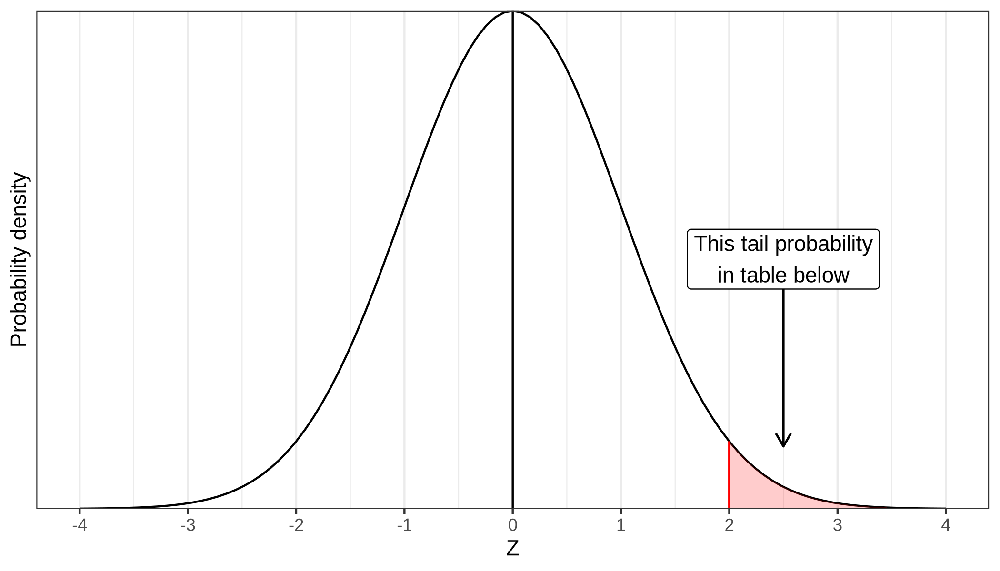

## General Part

Mean: $\bar{X} = \frac{\Sigma_{i=1}^nx_i}{N}$

Variance: $S^2_x = \frac{\Sigma_{i=1}^n(x_i-\bar{x})^2}{n-1}$

Standardized values (Z-values): $Z = \frac{X-\mu}{\sigma}$

Z-statistic in one sample Z-test: $Z = \frac{\bar{x}-\mu_x}{\sigma_{x}}$

Standard error of the mean: $\sigma_{\bar{x}} = \frac{\sigma}{\sqrt{n}}$

Cohen’s d: $\frac{\bar{X}_1-\bar{X}_2}{s_{pooled}}$

$s^2_{pooled} = \frac{(n_1-1)*s_1^2 + (n_2-1)*s_2^2}{n_1+n_2-2}$

$s_{pooled} = \sqrt{s^2_{pooled}}$

# Z-table

Table gives the right-tail probability corresponding to a Z-value of the value in the Z-column plus the value in the column name, which indicates the second digit of the Z-score.

```{r echo = FALSE}
library(ggplot2)
if(!file.exists("ztable.png")){
  p <- ggplot(data = data.frame(x = c(-4, 4)), aes(x)) +
  stat_function(fun = dnorm, args = list(mean = 0, sd = 1)) +
  ylab("Probability density") +
  xlab("Z") +
  scale_y_continuous(breaks = NULL, expand = c(0,0)) +
  scale_x_continuous(breaks = c(-4:4)) +
  geom_vline(xintercept = 0, color = "black") +
  geom_area(stat = "function", fun = dnorm, fill = "red", alpha = .2, xlim = c(2, 4), args = list(mean = 0, sd = 1))+
  geom_segment(x = 2, xend = 2, y = 0, yend = dnorm(2), color = "red")+
  geom_segment(x = 2.5, xend = 2.5, y = .2, yend = .05,  arrow = arrow(length = unit(0.03, "npc")))+
  geom_label(x = 2.5, y = .2, label = "This tail probability\nin table below")+
  theme_bw()
ggsave("ztable.png", p, device = "png", width = 7, height = 4)
}


```

```{r echo = FALSE}
x <- seq(0, 3, by = .1)
y <- seq(0, .09, by = .01)

tab <- t(sapply(x, function(i){
  pnorm(i+y, lower.tail = FALSE)
}))

tab <- data.frame(Z = as.character(x), tab)
names(tab)[-1] <- y
# library(webshot2)
if(knitr::is_html_output()){
  library(DT)
    DT::datatable(tab, rownames = FALSE, options = list(ordering=F, pageLength = nrow(tab))) |>
    DT::formatRound(columns=names(tab)[-1], digits=3)
} else {
  knitr::kable(tab, digits = 3)
}

```
