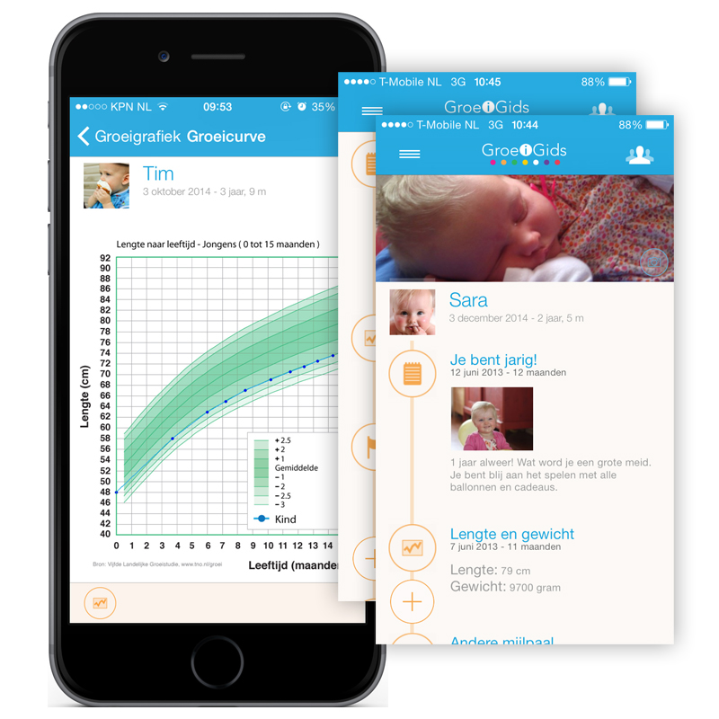
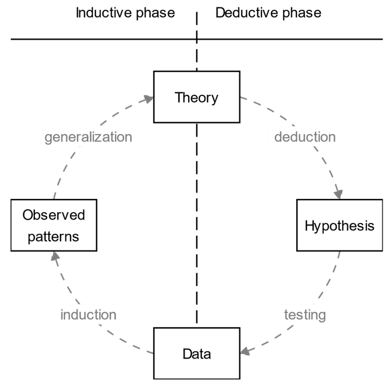
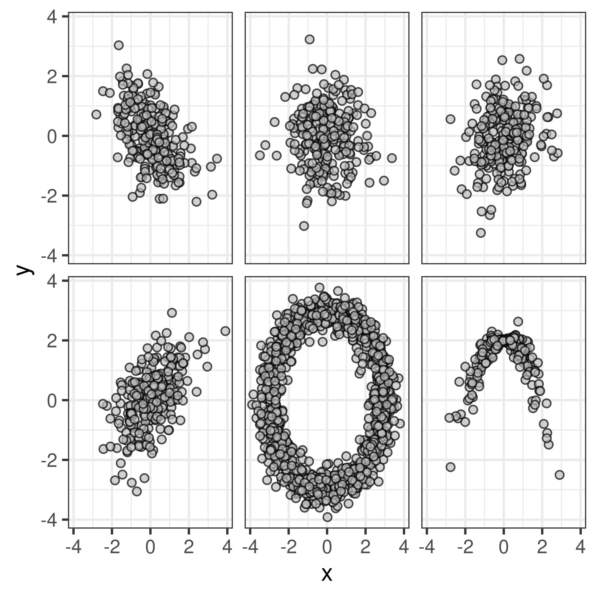
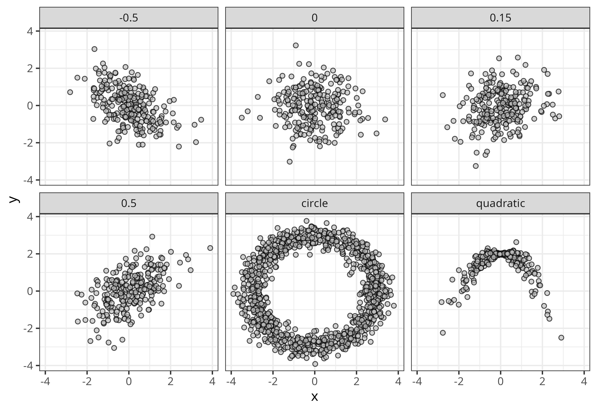

# Introduction


<!-- ## Today -->

<!--   * Lecture 1: Introduction -->
<!--     * Welcome -->
<!--     * Research Methodology and Data Analysis -->
<!--     * Samples versus Populations -->
<!--     * Measurement and Measurement Levels -->
<!--     * Descriptive Statistics and Graphs -->
<!--   * Literature covered -->
<!--     * Chapter 2: sections 2\.1\-2\.4\, 2\.6\-2\.8\, 2\.11\.1\, 2\.12 and Appendix 2A -->
<!--     * Chapter 4: sections 4\.1\-4\.5\, 4\.9\, 4\.12\-4\.13 -->
<!--     * Chapter 7: section 7\.1 -->

<!-- ## Welcome everyone -->

<!-- ## COURSE OVERVIEW -->

<!-- * What can you expect for this course? -->
<!--   * 14 lectures -->
<!--     * 10 common lectures\, 4 major specific lectures -->
<!--   * 11 lab sessions -->
<!-- * What will the examination look like? -->
<!--   * Multiple choice exam \(1\-10\) -->
<!--   * SPSS test \(Pass/ Fail\) -->
<!-- * What more do we offer you? -->
<!--   * Short lecture quizzes -->
<!--   * Midterm quiz -->
<!--   * Practice exams online -->
<!--   * Practice workbook online -->

<!--  -->

<!-- Major\-specific part -->

<!--  -->

<!--  -->

<!-- * What do I expect from you? -->
<!--   * Active participation during lectures and lab sessions -->
<!--   * Read the syllabus before contacting me with questions -->
<!--   * Be on time -->
<!-- * Preparation -->
<!--   * Lecture: Read the literature -->
<!--   * Lab session: https://bps\.uvt\.nl \(if you want\) -->

<!--  -->

```{r}
#| include = FALSE
library(kableExtra)
library(tidySEM)
library(gt)
library(dplyr)
options(knitr.kable.NA = '')
set.seed(1)
```


```{r}
#| label = "setup",
#| include = FALSE
knitr::opts_chunk$set(echo = FALSE)
library(ggplot2)
source("functions.R")
```

## Who are we? {.center}

::: {layout-ncol=2}

::: {style="display: flex; justify-content: center;"}
{fig-align="center" style="width: 250px; height: 250px; object-fit: cover; border-radius: 50%;"}

::: {.r-stack}
Don van den Bergh
:::

:::

::: {style="display: flex; justify-content: center;"}
{fig-align="center" style="width: 250px; height: 250px; object-fit: cover; border-radius: 50%;"}

::: {.r-stack}
Amirali Rezazadeh
:::

:::

:::

## Why statistics?

You grew up in the "digital age". There is data about your entire life...

## And everybody wants your data


::: {.r-stack style="height: 50vh;"}
{.fragment style="max-width: 70vw; max-height: 50vh; width: auto; height: auto; object-fit: contain;"}

{.fragment style="max-width: 70vw; max-height: 50vh; width: auto; height: auto; object-fit: contain;"}

{.fragment style="max-width: 70vw; max-height: 50vh; width: auto; height: auto; object-fit: contain;"}

{.fragment style="max-width: 70vw; max-height: 50vh; width: auto; height: auto; object-fit: contain;"}
:::


## What can you do with data?

* Data literacy is increasingly important in many jobs
* You can get insights from data to
    + Better understand social life
    + Predict sales and optimize marketing
    + Explore what activity in the brain is associated with observed behavior
* Data analysis is one of the most marketable concrete skills we teach at university

::: {.notes}
Basically every modern job uses data in some way.
The obvious ones are related to the technology, like apps and websites collecting your data.
But also in healthcare, doctors make decisions based on data.
Farmers decide what to plant based on data.
In fact, one of the most famous statisticians, Ronald Fisher, originally applied statistics to improve farmers yield, e.g., so their crops would grow better.
Here we focus more on social applications.
For example, we use data to gain insights into <list in slide>.
Altogether, Data analysis is one of the most marketable concrete skills taught at university
:::


## Difference between Methods and Statistics

Methods is about the procedures of research:

* What actions do we take to collect good data
* Which participants to include
* How to measure what we want to measure
* How to design studies that are suitable for answering our research questions

Methods involve the design of a study or data collection

## Difference between Methods and Statistics

Statistics is about analyzing data

* __Descriptive statistics__: describing/summarizing data
* __Inferential statistics__: Making best guesses about the population from a smaller sample
* __Statistical modeling__: Representing a theory mathematically
* Predicting important outcomes (sales, well-being, neurological disorders)
* Exploring data to find interesting patterns
* Performing tests to answer theoretical research questions

Statistics are the mathematics behind going from _raw data_ to conclusions.

::: {.notes}
TODO:

Wooclap question with T/F statements about methods vs statistics
:::

# Course Outline

## Overview

* What can you expect for this course?
  * 14 lectures
  * 10 lab sessions
* What will the exam look like?
  * Multiple choice exam \(1\-10\)
  * SPSS test \(Pass/ Fail\)
* What more do we offer you?
  * Additional video lectures
  * Short lecture quizzes
  * Midterm quiz
  * Practice exams online
  * Practice workbook online

## Learning Goals

* compute and interpret commonly used descriptive statistics
* recognize different probability distributions
* explain the essential aspects of null-hypothesis significance testing
* conduct statistical tests
* choose the appropriate analysis technique for answering a specific research problem
* use SPSS
* draw valid conclusions from the results of empirical data analyses given specific research questions envisaged

::: {.notes}

:::

<!--

    Aims
    This course covers the following learning goals:

    compute and interpret commonly used descriptive statistics such as the sample mean, the median, the mode, variance and standard deviation, the standard error, and the correlation coefficient.
    recognize different probability distributions such as the normal distribution, and make computations for these probability distributions.
    explain the essential aspects of null-hypothesis significance testing, including sampling distributions, Type I and Type II errors, one-tailed versus two-tailed testing, and statistical power.
    conduct statistical tests using the Z-distribution, the t-distribution, and the F-distribution
    perform regression analysis with one continuous or categorical predictor, and explain concepts like sums of squares, explained variance (R squared), raw and standardized regression coefficients, predicted scores, residuals and the assumptions of linear models;
    choose the appropriate analysis technique for answering a specific research problem from the range of techniques that are covered in the course.
    use the software package SPSS to perform several statistical data analyses and be able to correctly interpret and report the output to an informed audience (e.g., Liberal arts students, researchers from the social sciences/business and economics/cognitive neuroscience).
    draw valid conclusions from the results of empirical data analyses given specific research questions envisaged.

    Content
    The course uses challenge-based learning to convey the basics of statistics. You have access to all mandatory material for the course via a free interactive coursebook, complete with lecture videos, tutorial exercises, and formative tests. You will work in a small learning team of 4 students (minimum group size: 3 if a student drops out, 5 if there are not enough students to form an extra group) and choose your own dataset and any research question you are interested in (default datasets are available if you can't find one). With your learning team, you make two portfolio assignments in which you demonstrate that you master the learning goals and can use the techniques from this course to answer your own research questions.

    The course uses a flipped classroom approach. Each week before the "lecture", you watch the respective video, make the formative assessment, and submit one discussion question to class. During the "lecture", we cover the most commonly asked discussion questions in more detail, have peer-to-peer and group discussions about reflection questions related to the material to ensure deeper processing, apply the material to your portfolio, and make two exam questions which contribute to your grade.

    During the tutorial session, you practice working with statistical software to answer research questions, and you apply the same statistical software to work on your portfolio.
-->


## Grading

* Two Exams (each 30%): on 15-10-2026 and 10-12-2026
* Two Assignments (Portfolio; 40%): due 13-10-2026 and 14-12-2026
* Combined resit for both exams (60%): 06-01-2027


## Typical Schedule

* Monday: Lecture (either 10:45 - 12:30 or 16:45 - 18:30)
* Thursday/ Friday: Tutorial (12:45 - 14:30 or 14:45 - 16:30)

::: {.callout-note}
Always check TimeEdit for the most up to date information!
:::

# Dictionary of basic concepts

## Is life worth living?

9 out of 10 adults in the Netherlands think life is worth living

{fig-align="center"}

::: footer
Source: <www.cbs.nl/nl-nl/nieuws/2026/31/9-op-de-10-volwassenen-vinden-het-leven-de-moeite-waard>
:::

## Tabular data

Most data in the social sciences is tabular, where each row represents an individual $i$ observation, and each column $j$ represents that individual's data on several variables:

{fig-align="center"}


## Items

- I find my life worthwhile.
- I feel that I contribute something to society.
- I feel useful.
- I am able to do the things that I want to do and consider important in my life.
- How important are social contacts and relationships in your life?
- How important is personal development to you?
- How hopeful are you about the future? (1 - 10)

## Tabular data: Example

<!-- ```{r, cache=TRUE}
#| tbl-cap: "Happiness Data"
dataset <- read.csv("lecture1_scripts/cbs_zingeving_synthetic_2025.csv")
dataset |>
  slice_head(n = 5) |>
  gt() |>
  tab_options(quarto.disable_processing = TRUE)
``` -->

```{r}
#| echo: false
library(htmltools)

# 1. Build a beautiful 'gt' table
dataset <- read.csv("lecture1_scripts/cbs_zingeving_synthetic_2025.csv")
fancy_table <- dataset |>
  gt(rownames_to_stub = TRUE) |>
  tab_header(
    title = "Example responses",
    # subtitle = "Styled elegantly using the native {gt} package"
  ) |>
  # Apply professional formatting options
  tab_options(
    table.background.color = "white",
    row.striping.background_color = "#f9f9f9",
    container.height = px(400), # Keeps the header fixed while scrolling
    container.overflow.y = TRUE,
    table.width = pct(100),
    data_row.padding = px(6)    # Compact row sizing for slides
  ) |>
  opt_row_striping()

# 2. Output inside a scroll container to strictly enforce slide layout bounds
div(
  style = "max-height: 450px; overflow-y: auto; border: 1px solid #e0e0e0; border-radius: 4px;",
  fancy_table
)
```


::: footer
simulated based on the article
:::


<!-- ## Unstructured data

The counterpart is unstructured data.

For example:

* All posts someone makes on social media
    + The no. text posts differs per person
    + Text itself is often not
    + Uploaded photos/ videos don't quite fit in a rectangle

. . .

Confusingly, this does not mean this data is not interesting, and often also not that it truly has no structure.
It is not the data we focus on in the course.
 -->

## About Observations: Population

* The complete set of objects of interest
    + E.g., all people in NL, all students in this class
* Number of individuals in the population: N
    + N = 17.53 million, N = 75
* The correlation (linear dependence) between language and mathematics ability across all humans on earth
    + $\rho = .3$
* The `true' effect of class attendance on grades in university students
    + $\delta = 0.4$

## Population: Example

In the survey on happiness, the CBS interviewed 7,551 participants aged 15 and above.

What is the population?

. . .

Adults in the Netherlands / Above 15 year olds.

## About Observations: Sample

**Sample:**

* Observed part of the population
* Number of observations: *n*
* The correlation (linear dependence) between language and mathematics ability across all pupils measured as part of a study:
    + $r = .25$
* The effect size  of class attendance on grades observed at Tilburg University
    + $d = 0.4$

A common pattern is _upper case_ or _Greek_ symbols for the population and _lower case_ or _Roman_ symbols for the sample.

## About variables: Construct

**Construct:**

*	Abstract feature of interest for the population
    + E.g., Short Term Memory, intelligence, perseverance, education

**Operational definition:**

* Concrete measurable representation of the construct
    + E.g., Number of words recalled, the Wechsler Adult Intelligence Scale (WAIS),
    ability to withstand a tasty treat, highest degree obtained


## About variables: Variable

**Variable:**

* (Mathematical) placeholder for specific values
* E.g., `WAIS` is a variable representing scores on the WAIS
* You can refer to a variable without (yet) knowing its specific values

**Data:**

* Specific values of a variable
* Example of data: Jen's score on the variable `WAIS` is 138

## Example

* Construct: Happiness
* Operational definition: “On a scale from 1 to 10, to what extent do you consider yourself a happy person?”
* Variable: `happiness`, taking values 1–10
* Data: respondent 382 answered 8

## Wooclap

1. Methods vs. Statistics: which statement(s) are true?
- Methods involve mathematics, and statistics involve the design of a study.
- Methodology concerns itself with the best way to collect data to answer a question.
- Statistics can tell us if the data support the claim "older people feel like they contribute less to society than younger people".
- Statistics can guide answer which
- Statistics are a collection of different tests for different types of data.

2. Population vs. Sample: which statement(s) are true?
- 'Population' always refers to all people in a country
- If we could measure data for all subjects in a population, we wouldn't need statistics
- Sample statistics uses _Roman_ letters and population statistics use _Greek_ letters.
-

3. Constructs: which statement(s) are true?
- IQ score is a construct.
- Education is an operationalization of intelligence.
- We can observe and measure constructs directly.
- Scientific theories are typically on the level of operational definitions.

# Break {.unlisted}

See you in ~10 minutes!

# Role of data in scientific research

## Empirical cycle

De Groot (1961)

{fig-align="center"}

## Relationship between theory and empiricism

```{r, cache=TRUE}
#| eval = T
library(tidySEM)
lo <- get_layout("Construct A", "Construct B",
                 "Variable A", "Variable B", rows = 2)
edg <- data.frame(
  from = c("Construct A", "Variable A"),
  to = c("Construct B", "Variable B")
  )
p <- prepare_graph(layout = lo, edges = edg)
p$nodes$linetype <- c(2, 2, 1, 1)
p$nodes$fill <- c("gray90", "gray90", "white", "white")
p$edges$linetype <- c(2, 1)
plot(p)+geom_label(aes(x = c(3, 3), y = c(5, 3), label = c("Theoretical level", "Empirical level"), size = 20))
```

## Relationship between theory and empiricism

Theory:

Construct A influences construct B

* E.g., being exposed to war increases depression

Empirical test:

Variable A predicts variable B

* E.g., being deployed (yes/no) predicts scores on the SCL-90 depression questionnaire

## Sampling theory

<!-- ```{r}
#| out.width = "90%"
knitr::include_graphics("images/sample_population.png")
``` -->

{fig-align="center" width="90%"}

::: {.notes}
Cooking example

:::


## Samples: why?

* We want to make a claim about the population
* It is not possible to access the entire population
* We observe a part of the population: the *sample*
* Sample statistics are also our best guess about population parameters
    + Of course, sample statistics are not *equal to* population parameters
    + You will learn ways to express uncertainty about your best guess

## Samples: why?

* If the sample is *representative* of the population, your best guess will generalize better to the entire population and to new samples
* The best way to get a representative sample is *random sampling*
* Random sample:
    +	Every population individual has the same probability of being included

## Non-random samples

* Probability of inclusion unknown to the researcher
* Examples: convenience sampling, snowball sampling, cluster sampling
* Sampling bias
    + E.g., Individuals that are easy to access ave higher probability of being included

# Measurement level

## NOIR measurement levels

Measurement level: What kind of information is contained in a variable?

Mnemonic: `n o i r` = black in French

Subsequent levels carry incremental information


## NOIR measurement levels

<small>

* Nominal
    + Categories; values differ in name only (e.g., majors)
* Ordinal
    + Categories; additionally, values have meaningful order (e.g., SES groups, bachelor year 1, 2, 3)
* Interval
    + Numeric; additionally, distance between values is meaningful
    + A step from 1 to 2 is equally large as a step from 2 to 3, or 5 to 6
* Ratio
    + Numeric; additionally has a meaningful zero-point
    + Because of this, ratios between two values are also meaningful

</small>

## Interval v Ratio

* Celsius and Fahrenheit are interval scales
* Kelvin is a ratio scale

<!-- ```{r}
#| out.height = "400px"
knitr::include_graphics("images/Thermo1.png", dpi = NA)
``` -->

{fig-align="center" height="400px"}

## Interval v Ratio

<!-- ```{r}
#| out.height = "400px"
knitr::include_graphics("images/Thermo2.png", dpi = NA)
``` -->

{fig-align="center" height="400px"}

## Measurement level matters

* Measurement level is a property of the construct and of the operational definition
    + Ideally, the measurement level of the construct and its variable are the same
    + E.g., sex assigned at birth: nominal
    + E.g., gender identification: ordinal or continuous
* Measurement level determines what statistics and analyses you can use

## Other common distinctions

* Categorical variables: Nominal, Ordinal
* Continuous variables: Interval, Ratio
* Qualitative variable: Difference in kind, Nominal
* Quantitative variables: Differences in degree; ordinal, interval, ratio

Edge cases:

* Number of children (discrete ratio)
* Political orientation from liberal to conservative (ordinal, but which is higher/lower?)

::: {.notes}

TODO: use age as another edge case.

Is it a count variable? So no. years? Is that ordinal or Ratio?
If we do age groups < 15 years, < 25, etc. what then?
If we examine no. milliseconds since birth, what then?

:::

# Descriptive statistics

## Descriptive Statistics {.smaller}

* Descriptive statistics summarize data across a sample
* You nearly always examine them to get a sense of your dataset
    + E.g., which major is most common among LAS students?
    + How old are my students, on average?
    + How much do the ages of my students vary?
    + What's the gender distribution?
* Descriptive statistics *may* also be relevant to answer research questions
    + E.g.: When evaluating exam questions: Is the proportion of correct answers on this MC question greater than chance?


::: {.notes}

TODO: use age as another edge case.

Is it a count variable? So no. years? Is that ordinal or Ratio?
If we do age groups < 15 years, < 25, etc. what then?
If we examine no. milliseconds since birth, what then?

:::

## Distributions

| Type of variable | Central tendency | Graph |
| :-: | :-: | :-: |
| Nominal | Frequency distribution | Bar chart |
| Ordinal | (Cumulative) frequency distribution | Bar chart |
| Interval/ratio | (Normal) probability distribution | Histogram, density plot |

## A nominal variable

```{r}
#| results = "asis"
tab <- sample(c("SS", "CN", "BE"), size = 75, replace = TRUE, prob = c(.6, .3, .1))
out <- data.frame(Major = names(table(tab)),
                  Frequency = as.vector(table(tab)),
                  Percent = as.vector(prop.table(table(tab))))
knitr::kable(out, row.names = FALSE, digits = 2)
```

## Bar chart

```{r}
#| results = "asis"
library(ggplot2)
ggplot(out, aes(x = Major, y = Frequency)) + geom_bar(stat = "identity") + theme_bw(base_size = 20)
```

## An ordinal variable

```{r}
#| results = "asis"
tab <- sample(ordered(c("Low", "Medium", "High"), levels = c("Low", "Medium", "High")), size = 75, replace = TRUE, prob = c(.4, .5, .1))
out <- data.frame(SES = ordered(levels(tab), levels = levels(tab)),
                  Frequency = as.vector(table(tab)),
                  Percent = as.vector(prop.table(table(tab))),
                  Cumulative = as.vector(cumsum(prop.table(table(tab)))))
knitr::kable(out, row.names = FALSE, digits = 2)
```

## Bar chart

```{r}
#| results = "asis"
library(ggplot2)
ggplot(out, aes(x = SES, y = Frequency)) + geom_bar(stat = "identity") + theme_bw(base_size = 20)
```

## A continuous variable

```{r}
dat <- data.frame(Height = rnorm(75, mean = sample(c(175, 165), 75, replace = T), sd = 5))
ggplot(dat, aes(x = Height)) + geom_histogram(bins = 20, colour = "white") + theme_bw(base_size = 20)
```

## Measures of central tendency

What is the average or most common response?

| Type of measure | Type of variable | Definition |
| :-: | :-: | :-: |
| Mode | Nominal/Ordinal | Most common value |
| Median | Ordinal/Continuous | Middle value/50th percentile |
| Mean | Continuous | Average value |

## Measures of dispersion

How much variability is there in responses?

| Type of measure | Type of variable | Definition |
| :-: | :-: | :-: |
| Frequency table | Nominal | Count/percentage of responses |
| Range | Ordinal/continuous | Minimum to maximum value |
| Variance | Continuous | Mean squared distance of observations to the mean |

## Calculating the variance

Variance:

$$
S_X^2 = \frac{\sum_{i=1}^n(X_i-\bar{X})^2}{n-1}
$$

Units of $S^2$ are squared; if you measured height in $CM$, $S^2_{height}$ is expressed in $CM^2$

Standard deviation (SD): $S_X = \sqrt{S_X^2}$

## Median and Mode for ordinal variable

__Median:__  middle value

Example 1: \( _n_  = unequal\):  4\, 5\, 6\, 7\, 8\, 9\, 9 -> median is 7

Example 2: \( _n_  = equal\):  4\, 5\, 6\, 8\, 9\, 9 -> median 7 \(mean of the two middle values\)

__Mode:__  Most frequent score; 9 in both examples


## Mean, median, mode for continuous variable


The average Australian is a millionaire

But... most Australians are not!

[https://www.volkskrant.nl/columns-opinie/australiers-zijn-gemiddeld-miljonair-maar-daar-hebben-de-meeste-australiers-helemaal-niks-aan~b8aa3fd3/](https://www.volkskrant.nl/columns-opinie/australiers-zijn-gemiddeld-miljonair-maar-daar-hebben-de-meeste-australiers-helemaal-niks-aan~b8aa3fd3/)

## Skewed Distributions


<!-- __Q:__  Can you think of variables that typically have skewed distributions? -->

<!--  -->

<!--  -->

<!--  -->

<!--  -->

<!--  -->

<!--  -->

## Mean, variance

```{r}
# df <- data.frame(x <- rnorm(rep(c(-5, 0, 5), each = 5), rep(c(.5, 1), each = 5)),
#                  Distribution = paste0("M = ", rep(c(-5, 0, 5), each = 2000), ", SD = ", rep(c(.5, 1), each = 1000)))
# ggplot(df, aes(x = x, color = Distribution, fill = Distribution)) + geom_density(alpha = .2)
ggplot(data.frame(x = c(-4, 4)), aes(x)) +
  mapply(function(mean, sd, col) {
    stat_function(fun = dnorm, args = list(mean = mean, sd = sd), col = col)
  },
  # enter means, standard deviations and colors here
  # mean = c(-5, 0, 5, -5, 0, 5),
  # sd = c(1, 1, 1, .5, .5, .5),
  # col = c('red', 'red', 'red', 'blue','blue','blue')
  mean = c(0, 0),
  sd = c(1, .5),
  col = c('red', 'blue')
) + theme_bw(base_size = 20) + labs(x = "Value", y = "Probability")
```

# Bivariate descriptives {.smaller}

Describing associations

|   | Nominal | Ordinal | Interval/Ratio |
| :-: | :-: | :-: | :-: |
| Nominal | Contingency Table | Contingency Table | Contingency table |
| Ordinal |   | Contingency Table<br />Spearman’s correlation | Biserial Correlation |
| Interval/Ratio |   |   | Pearson Correlation Coefficient<br />Scatter plot |


<!-- |   | Nominal | Ordinal | Interval/Ratio | -->
<!-- | :-: | :-: | :-: | :-: | -->
<!-- | Nominal | Contingency Table | Contingency Table | Contingency table | -->
<!-- | Ordinal |   | Contingency Table<br />Spearman’s correlation | Biserial Correlation | -->
<!-- | Interval/Ratio |   |   | Pearson Correlation Coefficient<br />Scatter plot | -->

## Contingency table


Is there an association between gender and education?

## Correlation

> **Correlation:** A standardized measure of the strength of linear association between two continuous variables.

* Standardized: ranges from [-1, 1]
* Sample correlation: $r$
* Population correlation: $\rho$
* r = -1: Perfect negative association
* r =  0: No association
* r =  1: Perfect positive association

## Correlations

{fig-align="center"}

## Correlations

{fig-align="center"}

<!--
::: {layout-nrow=2}


::: -->
